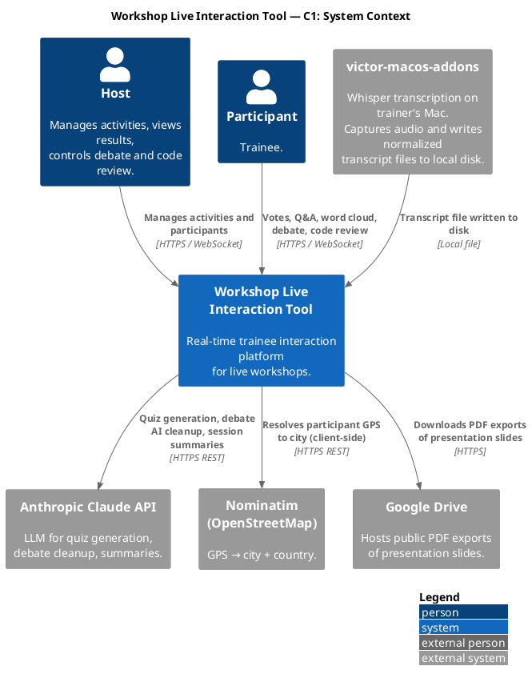
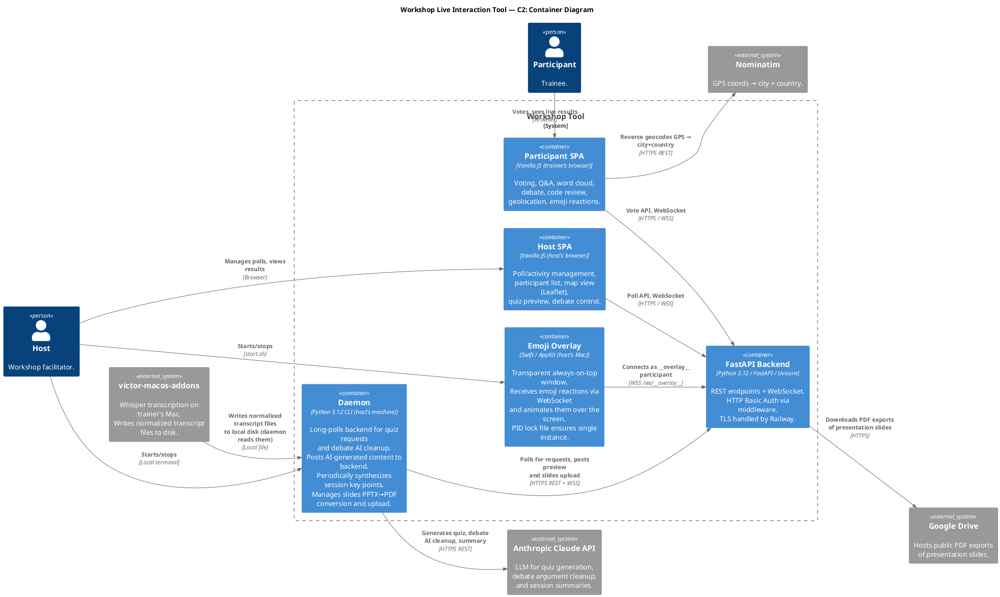

# Architecture Reference

> **This is the go-to document for understanding the system architecture.**
> For product requirements, tech stack, AppState schema, and workflow rules, see [CLAUDE.md](CLAUDE.md).

---

## C1 — System Context

Who uses the system and what external systems it touches.



---

## C2 — Containers

The five runtime processes and how they communicate.



---

## C3 — Backend Components

All FastAPI routers, the core infrastructure package, and how they connect.

```plantuml
@startuml c3_backend
!include https://raw.githubusercontent.com/plantuml-stdlib/C4-PlantUML/master/C4_Component.puml

title Backend — C3 Component Diagram

LAYOUT_WITH_LEGEND()

Container_Ext(participant_spa, "Participant SPA", "Vanilla JS in trainee's browser")
Container_Ext(host_spa, "Host SPA", "Vanilla JS in host's browser")
Container_Ext(daemon, "Daemon", "Python CLI on host's Mac")
Container_Ext(emoji_overlay, "Emoji Overlay", "Swift app on host's Mac")
ContainerDb_Ext(sqlite_db, "SQLite Database", "data/state.db")

Container_Boundary(backend, "FastAPI Backend") {

  Component(core, "core/", "Python package", "Shared infrastructure:\nstate.py (AppState singleton),\nauth.py (HTTP Basic Auth),\nmetrics.py (Prometheus),\nnames.py (conference mode names),\nmessaging.py (registry + broadcast),\nstate_builder.py (core WS state)")

  Component(ws, "features/ws", "FastAPI router", "WebSocket endpoints:\n/ws/{uuid} — participant, host, overlay\n/ws/daemon — daemon heartbeat + slide upload\nDispatches all real-time messages.\nSends personalized state on connect.")

  Component(poll, "features/poll", "FastAPI router", "POST /api/poll\nPUT /api/poll/status\nPUT /api/poll/correct\nPOST /api/poll/timer\nDELETE /api/poll\nGET /api/quiz-md\nGET /api/suggest-name\nGET /api/status\nPOST /api/pending-deploy")

  Component(qa, "features/qa", "FastAPI router", "PUT /api/qa/question/{id}/text\nDELETE /api/qa/question/{id}\nPUT /api/qa/question/{id}/answered\nPOST /api/qa/clear")

  Component(wordcloud, "features/wordcloud", "FastAPI router", "POST /api/wordcloud/topic\nPOST /api/wordcloud/clear")

  Component(codereview, "features/codereview", "FastAPI router", "POST /api/codereview (smart paste)\nPUT /api/codereview/status\nPUT /api/codereview/confirm-line\nDELETE /api/codereview")

  Component(debate, "features/debate", "FastAPI router", "POST /api/debate\nPOST /api/debate/reset\nPOST /api/debate/close-selection\nPOST /api/debate/force-assign\nPOST /api/debate/phase\nPOST /api/debate/first-side\nPOST /api/debate/round-timer\nPOST /api/debate/end-round\nPOST /api/debate/end-arguments\nGET /api/debate/ai-request\nPOST /api/debate/ai-result")

  Component(quiz, "features/quiz", "FastAPI router", "POST/GET /api/quiz-request\nPOST /api/quiz-status\nPOST/DELETE /api/quiz-preview\nPOST/GET /api/quiz-refine")

  Component(summary, "features/summary", "FastAPI router", "POST /api/summary\nGET /api/summary\nPOST /api/notes\nGET /api/notes\nPOST /api/transcript-status\nPOST/GET /api/summary/force\nPOST/GET /api/summary/full-reset\nPOST /api/token-usage")

  Component(leaderboard, "features/leaderboard", "FastAPI router", "POST /api/leaderboard/show\nPOST /api/leaderboard/hide\nDELETE /api/scores")

  Component(slides, "features/slides", "FastAPI router", "POST /api/slides/current\nDELETE /api/slides/current\nGET /api/slides (public)\nGET /api/slides/file/{slug} (public)\nGET /api/slides/catalog-map\nPOST /api/slides/upload\nGET /api/slides/drive-status")

  Component(session, "features/session", "FastAPI router", "POST /api/session/start|end|pause|resume\nPOST /api/session/start_talk|end_talk\nPOST /api/session/create\nPATCH /api/session/rename\nGET /api/session/request\nPOST /api/session/sync\nGET /api/session/snapshot\nGET /api/session/folders\nGET /api/session/interval-lines.txt\nPOST /api/session/timing_event")

  Component(snapshot, "features/snapshot", "FastAPI router", "GET /api/state-snapshot\nPOST /api/state-restore")

  Component(pages, "features/pages", "FastAPI router", "GET / → participant.html\nGET /host → host.html\nGET /notes → notes.html")

  Component(activity, "features/activity", "FastAPI router", "POST /api/activity\n(switches current_activity)")
}

' External → Backend
Rel(participant_spa, ws, "WS connect, vote, Q&A,\ndebate, codereview, emoji", "WSS /ws/{uuid}")
Rel(participant_spa, pages, "GET /", "HTTPS")
Rel(participant_spa, poll, "GET /api/status, /api/suggest-name", "HTTPS")

Rel(host_spa, ws, "Host WS connection", "WSS /ws/__host__")
Rel(host_spa, pages, "GET /host, /notes", "HTTPS")
Rel(host_spa, poll, "Manage polls", "HTTPS")
Rel(host_spa, activity, "Switch activity", "HTTPS")
Rel(host_spa, wordcloud, "Word cloud lifecycle", "HTTPS")
Rel(host_spa, qa, "Manage Q&A", "HTTPS")
Rel(host_spa, codereview, "Code review lifecycle", "HTTPS")
Rel(host_spa, debate, "Manage debate", "HTTPS")
Rel(host_spa, leaderboard, "Show/hide leaderboard, reset scores", "HTTPS")
Rel(host_spa, summary, "Summary, notes, transcript", "HTTPS")
Rel(host_spa, slides, "Set/clear current slides", "HTTPS")
Rel(host_spa, session, "Session lifecycle", "HTTPS")

Rel(daemon, quiz, "Quiz pipeline (long-poll + preview)", "HTTPS")
Rel(daemon, summary, "Summary + transcript status", "HTTPS")
Rel(daemon, session, "Session sync + snapshot", "HTTPS")
Rel(daemon, ws, "Daemon WS (heartbeat + slide upload)", "WSS /ws/daemon")
Rel(daemon, slides, "Upload converted PDFs", "HTTPS")

Rel(emoji_overlay, ws, "WS /ws/__overlay__\n(emoji reactions)", "WSS")

' Internal relationships
Rel(ws, core, "Reads/writes state, dispatches\npersonalized broadcast", "")
Rel(poll, core, "Poll lifecycle, scoring")
Rel(qa, core, "Q&A questions lifecycle")
Rel(wordcloud, core, "Word cloud state")
Rel(codereview, core, "Code review lifecycle")
Rel(debate, core, "Debate lifecycle")
Rel(quiz, core, "Quiz pipeline state")
Rel(summary, core, "Summary points, notes, transcript")
Rel(leaderboard, core, "Leaderboard visibility, score reset")
Rel(slides, core, "Slides list, slides_current")
Rel(session, core, "Full state snapshot + restore")
Rel(snapshot, core, "Serialize/deserialize AppState")

@enduml
```

---

## C3 — Daemon Components

All internal modules of the training daemon that runs on the host's Mac.

Key sub-systems:

| Sub-system | Modules | Role |
|---|---|---|
| **Orchestrator** | `daemon/__main__` | Starts all loops; exit code 42 triggers git pull + restart |
| **Quiz pipeline** | `quiz/generator`, `quiz/history`, `quiz/poll_api` | Reads transcript → LLM → posts preview to backend |
| **Debate AI** | `debate/ai_cleanup` | Deduplicates and suggests arguments via LLM |
| **Summary** | `summary/summarizer`, `summary/loop` | Delta-based key-point extraction from transcript |
| **Transcript** | `transcript/parser`, `loader`, `query`, `rebuild`, `session`, `state` | Reads normalized transcript files (produced by `victor-macos-addons`) |
| **Slides** | `slides/catalog`, `convert`, `drive_sync`, `upload`, `loop`, `daemon` | PPTX→PDF via LibreOffice/PowerPoint; uploads to backend |
| **RAG** | `rag/indexer`, `rag/retriever`, `rag/project_files` | Indexes project files; enriches quiz generation context |
| **Session state** | `daemon/session_state` | Reads/writes global state + per-session JSON to disk |
| **LLM adapter** | `daemon/llm/adapter` | Claude API wrapper with token counting |

```plantuml
@startuml c3_host_daemon
!include https://raw.githubusercontent.com/plantuml-stdlib/C4-PlantUML/master/C4_Component.puml

title Daemon — C3 Component Diagram

LAYOUT_WITH_LEGEND()

Container_Ext(fastapi, "FastAPI Backend", "HTTPS REST + WSS")
Container_Ext(claude_api, "Anthropic Claude API", "HTTPS REST")
System_Ext(macos_addons, "victor-macos-addons", "Writes normalized transcript files to disk")

Container_Boundary(daemon_pkg, "Daemon (Python 3.12, host's Mac)") {

  Component(main, "daemon/__main__", "Orchestrator", "Starts all background loops.\nGraceful shutdown on SIGTERM.\nExit code 42 triggers git pull + restart.\nOn WS reconnect: re-syncs active session\n(session_state.json) to backend.")

  Component(config_http, "daemon/config + daemon/http", "Config & HTTP", "DEFAULT_TRANSCRIPT_MINUTES, SESSIONS_FOLDER,\nTRANSCRIPTION_FOLDER env vars.\nShared HTTP helper with Basic Auth headers.")

  Component(quiz_gen, "daemon/quiz/generator", "Quiz generator", "Reads transcript or topic,\ncalls LLM, generates poll question + options.")

  Component(quiz_hist, "daemon/quiz/history", "Quiz history", "Tracks previously generated questions\nto avoid repetition.")

  Component(quiz_api, "daemon/quiz/poll_api", "Quiz poll API", "Posts quiz preview to backend.\nPolls /api/quiz-request and /api/quiz-refine.")

  Component(debate_ai, "daemon/debate/ai_cleanup", "Debate AI cleanup", "Deduplicates, fixes typos, suggests\nnew arguments via LLM.\nPolls /api/debate/ai-request, posts result.")

  Component(summarizer, "daemon/summary/summarizer", "Summarizer", "Delta-based key-point extraction from transcript.\nTwo-tier: notes + discussion points.")

  Component(summary_loop, "daemon/summary/loop", "Summary loop", "Polls /api/summary/force every few seconds.\nTriggered by host or participant Key Points button.")

  Component(transcript_parser, "daemon/transcript/parser", "Transcript parser", "Parses .txt, .vtt, .srt transcript formats.")

  Component(transcript_loader, "daemon/transcript/loader", "Transcript loader", "Reads last N minutes from normalized files.")

  Component(transcript_query, "daemon/transcript/query", "Transcript query", "CLI tool: query normalized transcripts\nby ISO datetime range.")

  Component(transcript_session, "daemon/transcript/session", "Transcript session", "Session-scoped transcript windowing.")

  Component(transcript_state, "daemon/transcript/state", "Transcript state", "Tracks transcript processing state.")

  Component(slides_catalog, "daemon/slides/catalog", "Slides catalog", "Reads materials_slides_catalog.json.\nResolves PPTX → target PDF mappings.")

  Component(slides_convert, "daemon/slides/convert", "PPTX converter", "Converts PPTX to PDF via LibreOffice or PowerPoint.")

  Component(slides_upload, "daemon/slides/upload", "Slides uploader", "Uploads converted PDFs to backend via WSS.")

  Component(slides_loop, "daemon/slides/loop", "Slides loop", "Watches catalog for changes, triggers\nconvert + upload pipeline.")

  Component(slides_daemon, "daemon/slides/daemon", "Slides daemon main", "Manages slide WS connection to backend.\nHandles upload requests and results.")

  Component(materials_mirror, "daemon/materials/mirror", "Materials mirror", "Mirrors project files to server_materials/.\nKeeps backend's RAG index fresh.")

  Component(materials_ws, "daemon/materials/ws_runner", "Materials WS runner", "WebSocket runner for materials upload.")

  Component(rag_indexer, "daemon/rag/indexer", "RAG indexer", "Indexes project files into vector store.")

  Component(rag_retriever, "daemon/rag/retriever", "RAG retriever", "Retrieves relevant context for quiz generation.")

  Component(rag_files, "daemon/rag/project_files", "Project files scanner", "Scans and lists project files.\nHandles Claude tool calls for file reading.")

  Component(llm, "daemon/llm/adapter", "LLM adapter", "Claude API wrapper.\nToken counting & cost tracking.\ncreate_message() with timeout.")

  Component(session_state, "daemon/session_state", "Session + global state", "Global state: training-assistant-global-state.json stores active_session_id only.\nSession metadata (started_at, paused_intervals) stored in session_meta.json per session folder.\nAt startup, scans session folders to find active session by ID.\nAlso persists full server snapshot to session_state.json per folder.")

  Component(lock, "daemon/lock", "Process lock", "PID file ensures single daemon instance.")
}

' Orchestration
Rel(main, summary_loop, "starts")
Rel(main, slides_loop, "starts")
Rel(main, materials_mirror, "starts")
Rel(main, session_state, "starts polling loop")

' Transcript reading
Rel(transcript_loader, transcript_parser, "uses")
Rel(transcript_loader, transcript_state, "uses")

' Quiz pipeline
Rel(quiz_api, fastapi, "GET /api/quiz-request\nGET /api/quiz-refine", "HTTPS")
Rel(quiz_api, quiz_gen, "triggers on request")
Rel(quiz_gen, transcript_loader, "reads last N minutes")
Rel(quiz_gen, rag_retriever, "enriches context")
Rel(quiz_gen, llm, "LLM call")
Rel(quiz_gen, quiz_hist, "checks history")
Rel(quiz_api, fastapi, "POST /api/quiz-preview\nPOST /api/quiz-status", "HTTPS")

' Debate AI pipeline
Rel(debate_ai, fastapi, "GET /api/debate/ai-request\nPOST /api/debate/ai-result", "HTTPS")
Rel(debate_ai, llm, "LLM call")

' Summary pipeline
Rel(summary_loop, fastapi, "GET /api/summary/force\nPOST /api/summary", "HTTPS")
Rel(summary_loop, summarizer, "triggers")
Rel(summarizer, transcript_loader, "reads transcript")
Rel(summarizer, llm, "LLM call")

' Slides pipeline
Rel(slides_loop, slides_catalog, "reads")
Rel(slides_loop, slides_convert, "triggers conversion")
Rel(slides_daemon, slides_upload, "triggers upload")
Rel(slides_upload, fastapi, "uploads PDF via WSS", "WSS /ws/daemon")

' Session
Rel(session_state, fastapi, "GET /api/session/snapshot\nGET /api/session/request\nPOST /api/session/sync", "HTTPS")

' RAG
Rel(rag_indexer, rag_files, "uses")
Rel(rag_retriever, rag_indexer, "queries")

' victor-macos-addons → transcript files → daemon
Rel(macos_addons, transcript_loader, "Writes normalized transcript files\n(daemon reads local disk)", "Local file")

' External calls
Rel(llm, claude_api, "claude-haiku / claude-sonnet\nAPI calls", "HTTPS")

@enduml
```

---

## C3 — Desktop Overlay & Wispr Addons

```plantuml
@startuml c3_desktop_overlay
!include https://raw.githubusercontent.com/plantuml-stdlib/C4-PlantUML/master/C4_Component.puml

title Desktop Overlay & Wispr Addons — C3 Component Diagram

LAYOUT_WITH_LEGEND()

Container_Ext(fastapi, "FastAPI Backend", "WSS /ws/__overlay__")
Container_Ext(claude_api, "Anthropic Claude API", "HTTPS REST (Haiku)")

Container_Boundary(overlay, "Emoji Overlay (Swift / AppKit, host's Mac)") {

  Component(app_delegate, "AppDelegate", "Swift / AppKit", "App entry point.\nManages window lifecycle.\nConnects WebSocket to backend on launch.")

  Component(overlay_panel, "OverlayPanel", "NSPanel subclass", "Transparent always-on-top window.\nCovers full screen, ignores mouse events.\nPID lock file ensures single instance.")

  Component(emoji_animator, "EmojiAnimator", "Swift / AppKit", "Receives emoji reactions from WebSocket.\nAnimates emoji sprites flying up the screen.\nSelf-removing after animation completes.")

  Component(button_bar, "ButtonBar", "Swift / AppKit", "Small floating button bar (not transparent).\nHost-triggered controls:\n• Sound effects\n• Overlay show/hide toggle")

  Component(sound_manager, "SoundManager", "Swift / AVFoundation", "Plays applause, drum roll, fanfare sounds.\nTriggered by host via ButtonBar.")
}

Container_Boundary(wispr, "Wispr Addons (Python, host's Mac)") {

  Component(clean_py, "wispr-addons/clean.py", "Python / pyobjc", "CGEventTap intercepts all keyboard & mouse events.")

  Component(clipboard_capture, "Clipboard capture", "Python / pyobjc", "Cmd+V: stores clipboard at each paste.\nCmd+Ctrl+V: sends to Claude Haiku for cleanup,\nundoes original paste, re-pastes cleaned version.\nCmd+Ctrl+Opt+V: same but adds contextual emojis.")

  Component(dictation_mute, "Dictation mute", "Python / pyobjc", "Mouse Button 5 (Wispr Flow dictation toggle):\nPauses media playback, lowers loopback volume.\nEscape while dictating: restores volume + media.")
}

' Overlay connections
Rel(app_delegate, overlay_panel, "creates + manages")
Rel(app_delegate, emoji_animator, "creates + starts")
Rel(app_delegate, button_bar, "creates + shows")
Rel(app_delegate, fastapi, "WS connect as __overlay__\nReceives emoji_reaction events", "WSS")
Rel(emoji_animator, overlay_panel, "renders emoji sprites on")
Rel(button_bar, sound_manager, "triggers sounds")

' Wispr connections
Rel(clean_py, clipboard_capture, "contains")
Rel(clean_py, dictation_mute, "contains")
Rel(clipboard_capture, claude_api, "POST to Claude Haiku\nfor grammar/filler cleanup", "HTTPS")

@enduml
```

---

## Messaging Registry Pattern

Source: [`docs/messaging-registry.md`](docs/messaging-registry.md)

### Problem & Solution

`core/messaging.py` owns only the WebSocket broadcast infrastructure. Each feature registers its own state-serialization logic at import time via `register_state_builder(name, for_participant_fn, for_host_fn)`. On every broadcast, the registry merges all feature contributions into one state payload.

```
┌─────────────────────────────────────────────────────────────┐
│                    core/messaging.py                        │
│  register_state_builder(feature, for_participant, ...)      │
│  build_participant_state(pid) → merges all builders         │
│  build_host_state()          → merges all builders          │
│  broadcast_state() / broadcast() / send_*()                 │
└─────────────────────────────────────────────────────────────┘
         ▲ registered at import time by each feature
         │
  ┌──────┴──────┬──────────────┬──────────────┬──────────────┐
  │             │              │              │              │
poll/       qa/          debate/       codereview/    leaderboard/
state_      state_        state_        state_         state_
builder.py  builder.py    builder.py    builder.py     builder.py
  │             │              │              │              │
wordcloud/  slides/        features/
state_      state_         core_state_
builder.py  builder.py     builder.py
```

### How to Add a New Feature

1. Create `features/myfeature/state_builder.py` with `build_for_participant(pid)` and `build_for_host()`.
2. At the bottom of the file: `from core.messaging import register_state_builder; register_state_builder("myfeature", build_for_participant, build_for_host)`.
3. Import the file somewhere in the startup path (e.g. feature `__init__.py` or `main.py`).
4. No changes to `core/messaging.py`.

### State Builder Responsibilities

| File | Participant keys | Host-only extras |
|---|---|---|
| `features/core_state_builder.py` | type, backend_version, mode, my_score, my_avatar, my_name, current_activity, participant_count, host_connected, summary_*, notes_content, screen_share_active | participants list, overlay_connected, daemon_*, quiz_preview, token_usage, transcript_*, needs_restore, pending_deploy |
| `features/poll/state_builder.py` | poll, poll_active, poll_timer_*, vote_counts, my_vote, poll_correct_ids | same without my_vote |
| `features/qa/state_builder.py` | qa_questions (with is_own, has_upvoted) | qa_questions (without personal fields) |
| `features/wordcloud/state_builder.py` | wordcloud_words, wordcloud_word_order, wordcloud_topic | same |
| `features/codereview/state_builder.py` | codereview (with my_selections, line_percentages) | codereview (with line_counts, line_participants) |
| `features/debate/state_builder.py` | debate_* (with my_side, is_own, has_upvoted, my_is_champion, auto_assigned) | debate_* (without personal fields) |
| `features/leaderboard/state_builder.py` | leaderboard_active, leaderboard_data (with your_rank, your_score) | leaderboard_active, top5 only |
| `features/slides/state_builder.py` | slides_current, session_main, session_talk, session_name | same |

---

## Daemon Persisted State

Source: [`docs/daemon-persisted-state.md`](docs/daemon-persisted-state.md)

### Disk Layout

- `sessions_root` = `SESSIONS_FOLDER` env var, default: `~/My Drive/Cursuri/###sesiuni`
- Global file: `${sessions_root}/training-assistant-global-state.json` — contains `session_id` of the currently active session
- Per-session: `${sessions_root}/${session_name}/session_state.json` — full serialized backend snapshot

```mermaid
classDiagram
    class SessionsRoot {
      +path: SESSIONS_FOLDER
    }
    class GlobalStateFile {
      +path: training-assistant-global-state.json
      +main: SessionRef?
      +talk: SessionRef?
      +session_id: string?
    }
    class SessionRef {
      +name: string
      +started_at: iso-datetime
      +ended_at: iso-datetime?
      +status: active|paused|ended
      +paused_intervals: PauseInterval[]
    }
    class PauseInterval {
      +from: iso-datetime
      +to: iso-datetime?
      +reason: explicit|nested|day_end
    }
    class SessionFolder {
      +name: string
      +path: /sessions_root/{name}
    }
    class SessionStateFile {
      +path: session_state.json
      +saved_at: iso-datetime
      +session_id: string
      +mode: workshop|conference
      +participants: map
      +activity: none|poll|wordcloud|qa|debate|codereview
      +poll: object?
      +qa: object
      +wordcloud: object
      +debate: object
      +codereview: object
      +leaderboard_active: bool
      +token_usage: object
      +slides_log: list
      +git_repos: list
    }

    SessionsRoot "1" o-- "1" GlobalStateFile : stores global
    SessionsRoot "1" o-- "*" SessionFolder : contains
    SessionFolder "1" o-- "1" SessionStateFile : stores per-session
    GlobalStateFile "1" --> "0..1" SessionRef : main
    GlobalStateFile "1" --> "0..1" SessionRef : talk
    SessionRef "1" o-- "*" PauseInterval
```

### Session Restore on Backend Restart

On daemon WS reconnect, the daemon re-sends `session_sync` with the full `session_state.json`. The backend restores all in-memory state (participants, scores, activity, poll/qa/debate/codereview) from this snapshot.

---

## Polling Loops & Background Jobs

All periodic timers, polling loops, and autonomous background jobs across the system.

### Daemon (Python, host's Mac)

| Job | Interval | File | Configurable? |
|---|---|---|---|
| **Main event loop** — orchestrates all sub-runners, processes WS messages | 1s | `daemon/config.py:24` | `DAEMON_POLL_INTERVAL` |
| **Lock heartbeat** — updates PID lock file to prevent multiple instances | 1s | `daemon/lock.py:13` | No |
| **PowerPoint probe** — detects active presentation + slide via stub/osascript | Every main loop tick (1s) | `daemon/__main__.py:~698` | No |
| ~~Transcript normalization~~ | — | Moved to `victor-macos-addons` repo | — |
| **Slides file watcher** — polls PPTX mtime, sends `slide_invalidated` on change | 5s | `daemon/slides/loop.py:51` | `SLIDES_POLL_INTERVAL_SECONDS` |
| **IntelliJ probe** — detects current project + branch via stub/osascript | 5s | `daemon/__main__.py:~761` | `_INTELLIJ_PROBE_INTERVAL` |
| **Slide activity logger** — accumulates time spent on each slide (foreground) | 5s | `daemon/__main__.py:~737` | `_PPT_TRACK_INTERVAL` |
| **Materials mirror** — syncs local files to backend via HTTP | 5s | `daemon/materials/mirror.py:109` | `MATERIALS_MIRROR_INTERVAL_SECONDS` |
| **RAG indexer** — watches materials folder for file changes | 0.5s poll + 2s debounce | `daemon/rag/indexer.py:355` | `DEBOUNCE_SECONDS` |
| **WS reconnect** — reconnects daemon WS on disconnect | 3s retry | `daemon/ws_client.py:14` | `_RECONNECT_INTERVAL` |
| **WS ping** — keepalive ping to backend | 20s | `daemon/ws_client.py:117` | `ping_interval` param |
| **Summary cycle** — on-demand only (triggered by WS `summary_force`) | Event-driven | `daemon/summary/loop.py:28` | N/A |

### FastAPI Backend (Python, Railway)

| Job | Interval | File | Configurable? |
|---|---|---|---|
| **State snapshot push** — pushes state + session snapshots to daemon for disk persistence | 7s | `features/ws/router.py:~460` | No (hardcoded `asyncio.sleep(7)`) |

### Host UI (JavaScript, host's browser)

| Job | Interval | File | Configurable? |
|---|---|---|---|
| **WS reconnect** | 3s retry | `static/host.js:196` | No |
| **Summary badge refresh** | 30s | `static/host.js:837` | No |
| **Poll timer countdown** | 200ms | `static/host.js:1747` | No |
| **Debate round timer** | 200ms | `static/host.js:2716` | No |
| **Inactivity counter** | 1s | `static/host.js:3626` | No |
| **Version age updater** | 60s (if deployed < 24h) | `static/version-age.js:49` | No |
| **Version reload guard** | 1s countdown (after mismatch detected) | `static/version-reload.js:93` | `countdownSeconds` (default 10) |

### Participant UI (JavaScript, participant's browser)

| Job | Interval | File | Configurable? |
|---|---|---|---|
| **WS reconnect** | 3s retry | `static/participant.js` | No |
| **Slides catalog refresh** | 30s (when overlay open) | `static/participant.js:243` | `SLIDES_REFRESH_MS` |
| **Q&A toast display** | 15s | `static/participant.js:3130` | No |
| **Debate toast display** | 15s | `static/participant.js:3156` | No |
| **Debate timer countdown** | 200ms | `static/participant.js:3431` | No |
| **Version age updater** | 60s (if deployed < 24h) | `static/version-age.js:49` | No |

### Landing Page (JavaScript)

| Job | Interval | File | Configurable? |
|---|---|---|---|
| **Host cookie auto-join poller** | 3s | `static/landing.html:207` | No |
| **Auto-join countdown** | 1s | `static/landing.html:185` | No |
| **Version status poll** | 30s | `static/host-landing.html:~25` | No |

---

## System Interactions (Sequence Flows)

The diagram covers 19 interaction flows:

| # | Flow | Key participants |
|---|---|---|
| 1 | Session lifecycle (start / pause / resume / end) | Host UI → Backend → Daemon |
| 2 | Participant join + geolocation | Participant UI → Backend → Host UI |
| 3 | Poll / Quiz flow | Host → Backend ↔ Daemon → Claude API |
| 4 | Q&A submit + upvote | Participant WS → Backend broadcast |
| 5 | Word cloud | Host → Backend ← Participant WS |
| 6 | Code review (smart paste, line select, confirm) | Host → Backend (→ Claude Haiku) ↔ Participant |
| 7 | Debate (sides, arguments, AI cleanup, volunteers, round timer) | Participant WS → Backend ↔ Daemon → Claude |
| 8 | Slide invalidation (PPTX change detected) | Daemon WS → Backend → Google Drive → Participant |
| 9 | Slide loading (PDF serve / cache) | Participant HTTP → Backend (→ Google Drive) |
| 10 | Follow trainer (PowerPoint probe) | Daemon WS → Backend → Participant |
| 11 | Paste text (participant → host) | Participant WS → Backend → Host WS |
| 12 | File upload | Participant HTTP → Backend → Host WS |
| 13 | Emoji reaction | Participant WS → Backend → Desktop Overlay WS |
| 14 | Activity switch | Host REST → Backend broadcast |
| 15 | Mode switch (workshop / conference) | Host REST → Backend broadcast |
| 16 | Summary / key points | Host or Participant → Backend WS → Daemon → Claude |
| 17 | Leaderboard show/hide | Host REST → Backend → Participant (personalized rank) |
| 18 | Daemon heartbeat & periodic state persistence | Daemon ↔ Backend every 7s |
| 19 | Backend restart recovery | Daemon WS reconnect → session_sync → full restore |

```plantuml
@startuml System Interactions
!pragma teoz true

title Workshop Live Interaction Tool — System Interactions

participant "Host UI" as H
participant "Participant UI" as P
participant "Backend\n(FastAPI)" as B
participant "Daemon" as D
participant "Desktop Overlay" as O
participant "Google Drive" as GD
participant "Claude API\n(Anthropic)" as AI

== 1. Session Lifecycle ==

H -> B : POST /api/session/start {name}
B --> D : WS session_request {action:"start", name, request_id}
D -> D : Create session folder\non disk
D --> B : WS global_state_saved {request_id, persisted:true,\n  global_state_file:"training-assistant-global-state.json"}
D --> B : WS session_sync {main, talk, key_points}
B --> H : WS broadcast (session state)

... (participants join, session running) ...

H -> B : POST /api/session/pause
B --> D : WS session_request {action:"pause", request_id}
B <-- D : WS global_state_saved {request_id, persisted:true}
B --> H : WS broadcast (status:"paused")
B --> P : WS session_paused → disconnect

H -> B : POST /api/session/resume
B --> D : WS session_request {action:"resume", request_id}
B <-- D : WS global_state_saved {request_id, persisted:true}
B --> H : WS broadcast (status:"active")
note right of P : Paused participants\nreconnect automatically

H -> B : POST /api/session/end
B --> D : WS session_request {action:"end", request_id}
D -> D : Persist state to disk
B <-- D : WS global_state_saved {request_id, persisted:true}

note over D,B
  Backend proactively pushes state and session snapshots
  to daemon every 7s via WS for disk persistence.
end note

== 2. Participant Join ==

P -> B : WS connect /ws/{uuid}
B -> P : WS accept
P --> B : WS set_name {name}
B -> B : Store participant_names[uuid]
B -> B : assign_avatar(uuid)
B --> P : WS full state (poll, activity, scores...)
B --> H : WS participant_update (list of participants)

opt Geolocation granted
  P -> P : Browser Geolocation API
  P --> B : WS location {city, country}
  B --> H : WS participant_update
end

opt Geolocation denied
  P --> B : WS location {timezone from Intl API}
end

== 3. Poll / Quiz Flow ==

group Host-created poll
  H -> B : POST /api/poll {question, options[], multi}
  B -> B : Store poll, set activity=POLL
  B --> P : WS broadcast (poll state)
  B --> H : WS broadcast (poll state)
end

group Quiz generation (daemon)
  H -> B : POST /api/quiz-request {minutes, topic}
  B --> D : WS quiz_request {minutes, topic}
  D --> B : WS quiz_status {status:"generating"}
  B --> H : WS broadcast quiz_status
  D -> AI : Claude API (transcript + prompt)
  AI --> D : Generated quiz JSON
  D --> B : WS quiz_preview {quiz}
  B --> H : WS broadcast quiz_preview
  H -> H : Host reviews quiz
  H -> B : POST /api/poll (accept quiz as poll)
  B --> P : WS broadcast (poll created)
end

H -> B : PUT /api/poll/status {open:true}
B -> B : poll_opened_at = now()
B --> P : WS broadcast (poll active)

P --> B : WS vote {option_id}
B -> B : Store votes[uuid], record vote_time
B --> P : WS vote_update {vote_counts, total_votes}
B --> H : WS vote_update

H -> B : PUT /api/poll/correct {correct_ids}
B -> B : Calculate speed-based scores\n(1000 max, 500 min, linear decay)
B --> P : WS result {correct_ids, voted_ids, score}
B --> H : WS broadcast (scores updated)

== 4. Q&A Flow ==

P --> B : WS qa_submit {text}
B -> B : Store qa_questions[qid]\nAward 100 pts to author
B --> P : WS broadcast (qa state)
B --> H : WS broadcast (qa state)

P --> B : WS qa_upvote {question_id}
B -> B : Add to upvoters set\n+50 pts to author, +25 pts to voter
B --> P : WS broadcast
B --> H : WS broadcast

H -> B : PUT /api/qa/question/{id}/text {text}
B --> P : WS broadcast
H -> B : DELETE /api/qa/question/{id}
B --> P : WS broadcast
H -> B : PUT /api/qa/question/{id}/answered {true}
B --> P : WS broadcast

== 5. Word Cloud Flow ==

H -> B : POST /api/wordcloud/topic {topic}
B -> B : Set wordcloud_topic
B --> P : WS broadcast (topic)

P --> B : WS wordcloud_word {word}
B -> B : Increment word count\n+200 pts to submitter
B --> P : WS broadcast (words updated)
B --> H : WS broadcast

H -> B : POST /api/wordcloud/clear
B --> P : WS broadcast (cleared)

== 6. Code Review Flow ==

H -> B : POST /api/codereview {snippet, language, smart_paste}

opt smart_paste enabled
  B -> AI : Claude Haiku: extract code
  AI --> B : {code, language}
end

B -> B : Store snippet, phase="selecting"
B --> P : WS broadcast (code review state)

P --> B : WS codereview_select {line}
B -> B : Add line to selections[uuid]
B --> P : WS broadcast
B --> H : WS broadcast

P --> B : WS codereview_deselect {line}
B -> B : Remove line from selections[uuid]
B --> P : WS broadcast

H -> B : PUT /api/codereview/status {open:false}
B -> B : phase = "reviewing"
B --> P : WS broadcast

H -> B : PUT /api/codereview/confirm-line {line}
B -> B : Add to confirmed set\n+200 pts per participant who flagged it
B --> P : WS broadcast (confirmed lines, scores)
B --> H : WS broadcast

== 7. Debate Flow ==

H -> B : POST /api/debate {statement}
B -> B : Reset debate state\nphase = "side_selection"
B --> P : WS broadcast

P --> B : WS debate_pick_side {side: "for"|"against"}
B -> B : Record side choice

opt >= 50% picked
  B -> B : Auto-assign remaining\nto balance teams
end

opt All assigned
  B -> B : phase = "arguments"
end

B --> P : WS broadcast

P --> B : WS debate_argument {text}
B -> B : Store argument\n+100 pts to author
B --> P : WS broadcast

P --> B : WS debate_upvote {argument_id}
B -> B : +50 pts to author\n+25 pts to voter
B --> P : WS broadcast

H -> B : POST /api/debate/end-arguments
B -> B : phase = "ai_cleanup"
B --> D : WS debate_ai_request {statement, for_args, against_args}
B --> P : WS broadcast (ai_cleanup phase)

D -> AI : Claude API (deduplicate, cleanup, suggest)
AI --> D : {merges, cleaned, new_arguments}
D --> B : WS debate_ai_result {merges, cleaned, new_arguments}
B -> B : Apply merges, add AI args\nphase = "prep"
B --> P : WS broadcast

P --> B : WS debate_volunteer
B -> B : Set champion for side\n+2500 pts
B --> P : WS broadcast

H -> B : POST /api/debate/round-timer {index, seconds}
B --> P : WS debate_timer
B --> H : WS debate_timer

== 8. Slide Update Flow (PPTX change) ==

D -> D : Watch PPTX folders\nfor mtime changes
D --> B : WS slide_invalidated {slug}

B -> B : Mark slug stale in cache_status
B --> P : WS broadcast (slides_cache_status updated)
B --> H : WS broadcast

note over D,B
  Daemon is source-of-truth for freshness.
  No proactive PDF download happens on invalidation.
  Download is triggered only by participant /check calls.
end note

== 9. Slide Loading Flow ==

P -> B : GET /api/slides
B --> P : HTTP 200 {slides:[{slug, title, drive_export_url, status, ...}]}

P -> B : GET /api/slides/check/{slug}
B --> D : WS proxy_request (GET /{sid}/api/slides/check/{slug})

P -> B : GET /api/slides/file/{slug}

alt PDF already cached
  D --> B : WS proxy_response (200)
  B --> P : HTTP 200 (check ok)
else PDF missing/stale
  D --> B : WS download_pdf {slug, drive_export_url}
  B -> GD : HTTP GET (download PDF)
  GD --> B : PDF bytes
  B -> B : Cache to /tmp/slides-cache/
  B --> D : WS pdf_download_complete {slug, status:"ok"}
  D --> B : WS proxy_response (200)
  B --> P : HTTP 200 (check ok)
else Download timeout/error
  D --> B : WS proxy_response (503)
  B --> P : HTTP 503 (check failed)
end

P -> B : GET /api/slides/download/{slug}
B --> P : HTTP 200 (PDF bytes)

P -> P : PDF.js renders in iframe
B --> P : WS slides_cache_status {slides:[{slug, status, ...}]}
B --> H : WS slides_cache_status {slides:[{slug, status, ...}]}

== 10. Follow Trainer (Slides) ==

D -> D : osascript probes PowerPoint\n(presentation name + slide number)
D --> B : WS slides_current {slug, current_page, presentation_name}
B -> B : Store slides_current
B --> P : WS slides_current {slug, page}
B --> H : WS broadcast

P -> P : Auto-navigate to page\n(if "follow" enabled)

note over D
  When PowerPoint closes or no presentation open,
  daemon sends slides_clear to remove current slide.
end note

== 11. Paste Text Flow ==

P --> B : WS paste_text {text}
B -> B : Store in paste_texts[uuid]\n(max 10 pending, 100KB limit)
B --> H : WS participant_update (paste icon visible)

H --> B : WS paste_dismiss {uuid, paste_id}
B -> B : Remove paste entry
B --> H : WS participant_update

== 12. File Upload Flow ==

P -> B : POST /api/upload (multipart file)
B -> B : Store file on disk\n(max 100KB, max 10 per participant)
B --> H : WS participant_update (upload icon visible)

H -> B : GET /api/upload/{uuid}/{file_id}
B --> H : HTTP 200 (file bytes)

== 13. Emoji Reaction Flow ==

P --> B : WS emoji_reaction {emoji}
B --> O : WS broadcast emoji to overlay
B --> H : WS broadcast emoji to host

O -> O : Animate emoji on screen

== 14. Activity Switch ==

H -> B : POST /api/activity {type: POLL|WORDCLOUD|QA|DEBATE|CODEREVIEW|NONE}
B -> B : Set current_activity
B --> P : WS broadcast (activity changed)
B --> H : WS broadcast

== 15. Mode Switch ==

H -> B : POST /api/mode {mode: "workshop"|"conference"}
B -> B : Set mode, assign character names\nif switching to conference
B --> P : WS broadcast (mode changed)
B --> H : WS broadcast

== 16. Summary / Key Points Flow ==

H -> B : POST /api/summary/force
note right: or participant triggers same endpoint\n(public, 30s cooldown)
B --> D : WS summary_force
D -> D : Read transcript from disk
D -> AI : Claude API (transcript + existing key points)
AI --> D : Diff (added/removed/edited points)
D -> D : Save updated key points to disk
D --> B : WS session_sync {key_points: [...]}
B -> B : Update summary_points
B --> P : WS broadcast (summary updated)
B --> H : WS broadcast

== 17. Leaderboard Flow ==

H -> B : POST /api/leaderboard/show
B -> B : leaderboard_active = true
B --> P : WS leaderboard {top5[], my_rank, my_score}
note right of P: Each participant receives\npersonalized rank
B --> H : WS leaderboard {top5[]}

H -> B : POST /api/leaderboard/hide
B --> P : WS leaderboard_hide
B --> H : WS leaderboard_hide

== 18. Daemon Heartbeat & State Persistence ==

D --> B : WS daemon_ping (periodic heartbeat)
B -> B : Update daemon_last_seen

B --> D : WS state_snapshot_result (periodic, every 7s)
B --> D : WS session_snapshot_result (periodic, every 7s)
D -> D : Write state-backup.json + session_state.json to disk

D --> B : WS transcript_status {line_count, total_lines}
B --> H : WS broadcast (transcript progress)

D --> B : WS token_usage {input_tokens, output_tokens, cost}
B --> H : WS broadcast (cost tracking)

== 19. Backend Restart Recovery ==

note over B : Backend restarts (deploy or crash)\nIn-memory state cleared

D -> D : WS disconnect detected (3s timeout)
D -> B : WS reconnect /ws/daemon
B --> D : WS accept

D --> B : WS session_folders {folders}
note over D : on_connect: re-sync active session
D -> D : Load session_state.json\nfrom active session folder
D --> B : WS session_sync {main, key_points, session_state}
B -> B : Restore session_main, scores,\nparticipants, activity state

H -> B : GET /api/session/active
B --> H : {auto_join:true, session_id}
H -> H : Auto-redirect to /host/{session_id}

@enduml
```


