# Architecture Reference

> Current runtime architecture for this repository as of 2026-04-09.
> This document is intentionally grounded in the code that runs today, not older plans or retired modules.

For product goals, workflow rules, and operational conventions, see [CLAUDE.md](CLAUDE.md).

## Table of Contents

- [Reality Today](#reality-today)
- [C1 - System Context](#c1---system-context)
- [C2 - Runtime Containers](#c2---runtime-containers)
- [C3 - Railway Backend](#c3---railway-backend)
- [C3 - Training Daemon and Local Host Runtime](#c3---training-daemon-and-local-host-runtime)
- [Frontend Surfaces](#frontend-surfaces)
- [State and Persistence](#state-and-persistence)
- [Key Runtime Flows](#key-runtime-flows)
- [Sequence Diagrams](#sequence-diagrams)
  - [Session Lifecycle and Recovery](#session-lifecycle-and-recovery)
  - [Participant Join and Geolocation](#participant-join-and-geolocation)
  - [Poll and Quiz](#poll-and-quiz)
  - [Q&A and Word Cloud](#qa-and-word-cloud)
  - [Code Review and Debate](#code-review-and-debate)
  - [Slides Cache and Follow Trainer](#slides-cache-and-follow-trainer)
  - [Participant-to-Host Inputs and Emoji](#participant-to-host-inputs-and-emoji)
  - [Activity, Summary, and Leaderboard](#activity-summary-and-leaderboard)
- [Practical Implications](#practical-implications)

---

## Reality Today

- Participant traffic is served from Railway. The participant journey is `landing.html` -> `/{session_id}` -> session-scoped REST and WebSocket calls.
- The host control plane is daemon-first. `python3 -m daemon` starts a local host panel at `http://127.0.0.1:1234/host`, serves the same static host assets there, mounts most live feature routers locally, and proxies the rest to Railway.
- Railway is now a thin session-aware bridge: page serving, session validation, browser WebSockets, daemon WebSocket, slide cache/downloads, temporary file uploads, and daemon-driven static sync.
- Most live workshop behavior lives in the daemon: session lifecycle, participant and host snapshots, poll/word cloud/Q&A/code review/debate state, quiz generation, slide orchestration, upload handoff, and local persistence.
- There is no standalone database in the current runtime. Railway keeps in-memory state plus temp files; the daemon persists session files on disk.
- Summary publication is currently file-driven, with `ai-summary.md` as the primary current path while legacy/fallback summary content can still exist in the session folder. Claude is currently used for quiz generation/refinement and debate cleanup.

---

## C1 - System Context

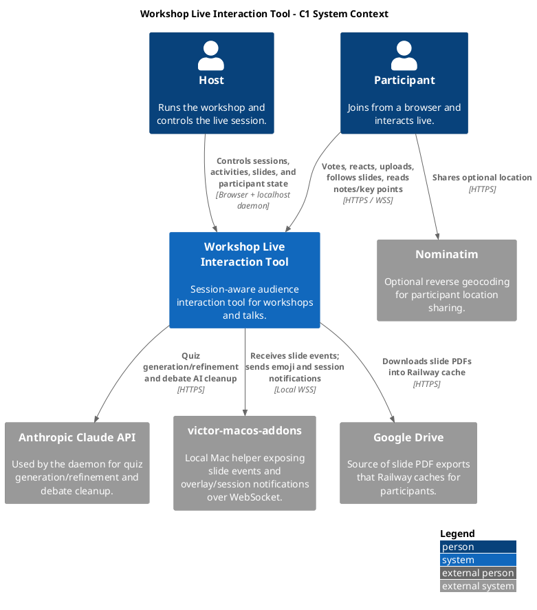
```plantuml
@startuml C1_SystemContext
!include <C4/C4_Context>

title Workshop Live Interaction Tool - C1 System Context
LAYOUT_WITH_LEGEND()

Person(host, "Host", "Runs the workshop and controls the live session.")
Person(participant, "Participant", "Joins from a browser and interacts live.")

System(workshop, "Workshop Live Interaction Tool", "Session-aware audience interaction tool for workshops and talks.")

System_Ext(claude_api, "Anthropic Claude API", "Used by the daemon for quiz generation/refinement and debate cleanup.")
System_Ext(macos_addons, "victor-macos-addons", "Local Mac helper exposing slide events and overlay/session notifications over WebSocket.")
System_Ext(nominatim, "Nominatim", "Optional reverse geocoding for participant location sharing.")
System_Ext(google_drive, "Google Drive", "Source of slide PDF exports that Railway caches for participants.")

Rel(host, workshop, "Controls sessions, activities, slides, and participant state", "Browser + localhost daemon")
Rel(participant, workshop, "Votes, reacts, uploads, follows slides, reads notes/key points", "HTTPS / WSS")

Rel(workshop, claude_api, "Quiz generation/refinement and debate AI cleanup", "HTTPS")
Rel(workshop, macos_addons, "Receives slide events; sends emoji and session notifications", "Local WSS")
Rel(participant, nominatim, "Shares optional location", "HTTPS")
Rel(workshop, google_drive, "Downloads slide PDFs into Railway cache", "HTTPS")
@enduml
```

---

## C2 - Runtime Containers

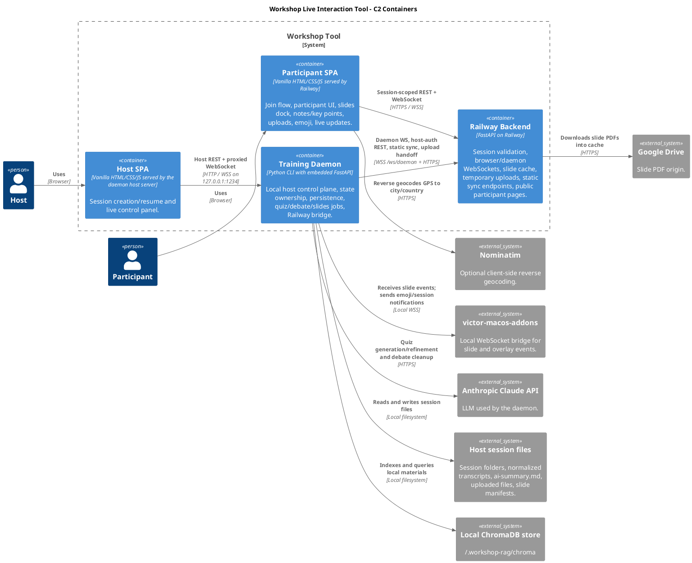
```plantuml
@startuml C2_Containers
!include <C4/C4_Container>

title Workshop Live Interaction Tool - C2 Containers
LAYOUT_LEFT_RIGHT()

Person(host, "Host")
Person(participant, "Participant")

System_Boundary(workshop, "Workshop Tool") {
    Container(participant_spa, "Participant SPA", "Vanilla HTML/CSS/JS served by Railway", "Join flow, participant UI, slides dock, notes/key points, uploads, emoji, live updates.")
    Container(host_spa, "Host SPA", "Vanilla HTML/CSS/JS served by the daemon host server", "Session creation/resume and live control panel.")
    Container(railway_backend, "Railway Backend", "FastAPI on Railway", "Session validation, browser/daemon WebSockets, slide cache, temporary uploads, static sync endpoints, public participant pages.")
    Container(training_daemon, "Training Daemon", "Python CLI with embedded FastAPI", "Local host control plane, state ownership, persistence, quiz/debate/slides jobs, Railway bridge.")
}

System_Ext(macos_addons, "victor-macos-addons", "Local WebSocket bridge for slide and overlay events.")
System_Ext(claude_api, "Anthropic Claude API", "LLM used by the daemon.")
System_Ext(nominatim, "Nominatim", "Optional client-side reverse geocoding.")
System_Ext(google_drive, "Google Drive", "Slide PDF origin.")
System_Ext(host_files, "Host session files", "Session folders, normalized transcripts, ai-summary.md, uploaded files, slide manifests.")
System_Ext(local_rag, "Local ChromaDB store", "~/.workshop-rag/chroma")

Rel(participant, participant_spa, "Uses", "Browser")
Rel(participant_spa, railway_backend, "Session-scoped REST + WebSocket", "HTTPS / WSS")
Rel(participant_spa, nominatim, "Reverse geocodes GPS to city/country", "HTTPS")

Rel(host, host_spa, "Uses", "Browser")
Rel(host_spa, training_daemon, "Host REST + proxied WebSocket", "HTTP / WSS on 127.0.0.1:1234")

Rel(training_daemon, railway_backend, "Daemon WS, host-auth REST, static sync, upload handoff", "WSS /ws/daemon + HTTPS")
Rel(training_daemon, claude_api, "Quiz generation/refinement and debate cleanup", "HTTPS")
Rel(training_daemon, macos_addons, "Receives slide events; sends emoji/session notifications", "Local WSS")
Rel(training_daemon, host_files, "Reads and writes session files", "Local filesystem")
Rel(training_daemon, local_rag, "Indexes and queries local materials", "Local filesystem")

Rel(railway_backend, google_drive, "Downloads slide PDFs into cache", "HTTPS")
@enduml
```

### Container split

| Container | Primary entrypoint | What it owns |
| --- | --- | --- |
| Participant SPA | [`static/landing.html`](static/landing.html), [`static/participant.html`](static/participant.html), [`static/participant.js`](static/participant.js) | Participant join flow and live UI rendered from Railway paths such as `/{session_id}` and `/{session_id}/api/*`. |
| Host SPA | [`static/host-landing.html`](static/host-landing.html), [`static/host-landing.js`](static/host-landing.js), [`static/host.html`](static/host.html), [`static/host.js`](static/host.js) | Host-only session creation/resume and live admin UI. The daemon advertises the local entrypoint `http://127.0.0.1:1234/host`. |
| Railway Backend | [`railway/app.py`](railway/app.py) | Session gating, browser and daemon WebSockets, slide cache/download serving, temporary uploads, public notes/key-points endpoints, and daemon-driven static file sync. |
| Training Daemon | [`daemon/__main__.py`](daemon/__main__.py) | Embedded host FastAPI server, feature state machines, session persistence, LLM jobs, addons bridge, upload handoff, and Railway bridge. |

---

## C3 - Railway Backend

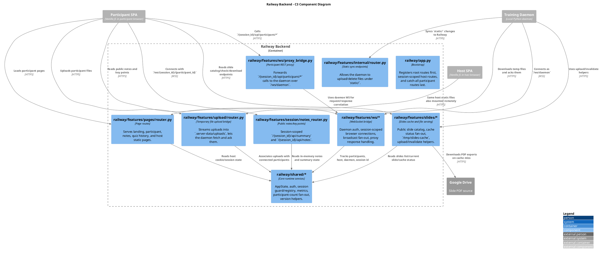
```plantuml
@startuml C3_RailwayBackend
!include <C4/C4_Component>

title Railway Backend - C3 Component Diagram
LAYOUT_WITH_LEGEND()

Container_Ext(participant_spa, "Participant SPA", "Vanilla JS in participant browser")
Container_Ext(host_spa, "Host SPA", "Vanilla JS in host browser")
Container_Ext(training_daemon, "Training Daemon", "Local Python daemon")
System_Ext(google_drive, "Google Drive", "Slide PDF source")

Container_Boundary(railway, "Railway Backend") {
    Component(app, "railway/app.py", "Bootstrap", "Registers root routes first, session-scoped host routes, and catch-all participant routes last.")
    Component(core, "railway/shared/*", "Core runtime services", "AppState, auth, session guard/registry, metrics, participant-count fan-out, version helpers.")
    Component(ws, "railway/features/ws/*", "WebSocket bridge", "Daemon auth, session-scoped browser connections, broadcast fan-out, proxy response handling.")
    Component(pages, "railway/features/pages/router.py", "Page routes", "Serves landing, participant, notes, quiz history, and host static pages.")
    Component(notes, "railway/features/session/notes_router.py", "Public notes/key points", "Session-scoped `/{session_id}/api/summary` and `/{session_id}/api/notes`.")
    Component(slides, "railway/features/slides/*", "Slides cache and file serving", "Public slide catalog, cache status fan-out, `/tmp/slides-cache`, upload/invalidate helpers.")
    Component(uploads, "railway/features/upload/router.py", "Temporary file upload bridge", "Streams uploads into `.server-data/uploads`, lets the daemon fetch and ack them.")
    Component(proxy, "railway/features/ws/proxy_bridge.py", "Participant REST proxy", "Forwards `/{session_id}/api/participant/*` calls to the daemon over `/ws/daemon`.")
    Component(internal, "railway/features/internal/router.py", "Static sync endpoints", "Allows the daemon to upload/delete files under `static/`.")
}

Rel(participant_spa, pages, "Loads participant pages", "HTTPS")
Rel(participant_spa, ws, "Connects with `/ws/{session_id}/{participant_id}`", "WSS")
Rel(participant_spa, proxy, "Calls `/{session_id}/api/participant/*`", "HTTPS")
Rel(participant_spa, notes, "Reads public notes and key points", "HTTPS")
Rel(participant_spa, slides, "Reads slide catalog/check/download endpoints", "HTTPS")
Rel(participant_spa, uploads, "Uploads participant files", "HTTPS")

Rel(host_spa, pages, "Same host static files also mounted remotely", "HTTPS")

Rel(training_daemon, ws, "Connects as `/ws/daemon`", "WSS")
Rel(training_daemon, uploads, "Downloads temp files and acks them", "HTTPS")
Rel(training_daemon, internal, "Syncs `static/` changes to Railway", "HTTPS")
Rel(training_daemon, slides, "Uses upload/invalidate helpers", "HTTPS")

Rel(ws, core, "Tracks participants, host, daemon, session id")
Rel(pages, core, "Reads host cookie/session state")
Rel(notes, core, "Reads in-memory notes and summary state")
Rel(slides, core, "Reads slides list/current slide/cache status")
Rel(uploads, core, "Associates uploads with connected participants")
Rel(proxy, ws, "Uses daemon WS for request/response correlation")

Rel(slides, google_drive, "Downloads PDF exports on cache miss", "HTTPS")
@enduml
```

### What Railway does today

- [`railway/app.py`](railway/app.py) is intentionally small. It mounts only the page routers, the daemon/browser WebSocket routers, slides, uploads, internal static-sync routes, public notes/key-points routes, and status/session helpers.
- Browser WebSockets are session-scoped: `"/ws/{session_id}/{participant_id}"` for participants and host, plus `"/ws/daemon"` for the daemon.
- Participant REST commands do not execute business logic inside Railway. They are forwarded by [`railway/features/ws/proxy_bridge.py`](railway/features/ws/proxy_bridge.py) to the daemon over the daemon WebSocket and resolved by a correlation-id response path.
- Railway state is in-memory only. [`railway/shared/state.py`](railway/shared/state.py) tracks connections, session metadata, slide cache status, temporary uploads, and a few mirrored UI fields.
- Current Railway runtime files are:
  - `.server-data/uploads` for temporary participant uploads waiting for daemon pickup
  - `/tmp/slides-cache` for cached Google Drive PDFs
  - `static/version.js` and `static/deploy-info.json`, stamped at startup
- There is no current SQLite or server-side domain database in the Railway runtime.

---

## C3 - Training Daemon and Local Host Runtime

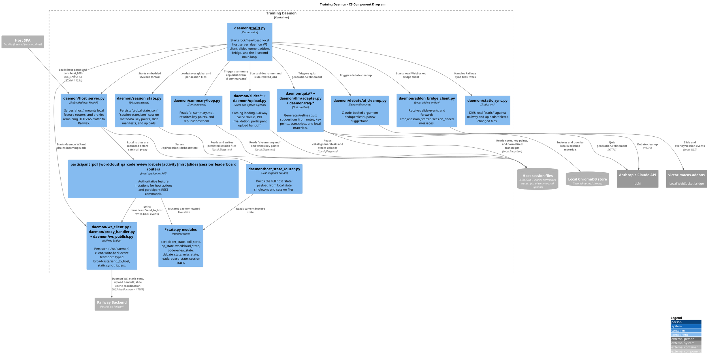
```plantuml
@startuml C3_TrainingDaemon
!include <C4/C4_Component>

title Training Daemon - C3 Component Diagram
LAYOUT_WITH_LEGEND()

Container_Ext(host_spa, "Host SPA", "Vanilla JS served from localhost")
Container_Ext(railway_backend, "Railway Backend", "FastAPI on Railway")
System_Ext(claude_api, "Anthropic Claude API", "LLM")
System_Ext(macos_addons, "victor-macos-addons", "Local WebSocket bridge")
ContainerDb_Ext(host_files, "Host session files", "SESSIONS_FOLDER, normalized transcripts, ai-summary.md, uploads")
ContainerDb_Ext(local_rag, "Local ChromaDB store", "~/.workshop-rag/chroma")

Container_Boundary(daemon_pkg, "Training Daemon") {
    Component(main, "daemon/__main__.py", "Orchestrator", "Starts lock/heartbeat, local host server, daemon WS client, slides runner, addons bridge, and the 1-second main loop.")
    Component(host_server, "daemon/host_server.py", "Embedded host FastAPI", "Serves `/host`, mounts local feature routers, and proxies remaining HTTP/WS traffic to Railway.")
    Component(feature_routes, "participant|poll|wordcloud|qa|codereview|debate|activity|misc|slides|session|leaderboard routers", "Local application API", "Authoritative feature mutations for host actions and participant REST commands.")
    Component(host_state, "daemon/host_state_router.py", "Host snapshot builder", "Builds the full host `state` payload from local state singletons and session files.")
    Component(state_singletons, "*state.py modules", "Runtime state", "participant_state, poll_state, qa_state, wordcloud_state, codereview_state, debate_state, misc_state, leaderboard_state, session stack.")
    Component(railway_bridge, "daemon/ws_client.py + daemon/proxy_handler.py + daemon/ws_publish.py", "Railway bridge", "Persistent `/ws/daemon` client, write-back event transport, typed broadcasts/send_to_host, static sync triggers.")
    Component(session_state, "daemon/session_state.py", "Disk persistence", "Persists `global-state.json`, `session-state.json`, session metadata, key points, slide manifests, and uploads.")
    Component(quiz, "daemon/quiz/* + daemon/llm/adapter.py + daemon/rag/*", "Quiz pipeline", "Generates/refines quiz suggestions from notes, key points, transcripts, and local materials.")
    Component(debate_ai, "daemon/debate/ai_cleanup.py", "Debate AI cleanup", "Claude-backed argument dedupe/cleanup/new suggestions.")
    Component(summary, "daemon/summary/loop.py", "Summary sync", "Reads `ai-summary.md`, rewrites key points, and republishes them.")
    Component(slides, "daemon/slides/* + daemon/upload.py", "Slides and upload pipeline", "Catalog loading, Railway cache checks, PDF invalidation, participant upload handoff.")
    Component(addons_bridge, "daemon/addon_bridge_client.py", "Local addons bridge", "Receives slide events and forwards emoji/session_started/session_ended messages.")
    Component(static_sync, "daemon/static_sync.py", "Static sync", "Diffs local `static/` against Railway and uploads/deletes changed files.")
}

Rel(host_spa, host_server, "Loads host pages and calls host APIs", "HTTP / WSS on 127.0.0.1:1234")

Rel(main, host_server, "Starts embedded Uvicorn thread")
Rel(main, railway_bridge, "Starts daemon WS and drains incoming work")
Rel(main, session_state, "Loads/saves global and per-session files")
Rel(main, quiz, "Triggers quiz generation/refinement")
Rel(main, debate_ai, "Triggers debate cleanup")
Rel(main, summary, "Triggers summary republish from `ai-summary.md`")
Rel(main, slides, "Starts slides runner and slide-related jobs")
Rel(main, addons_bridge, "Starts local WebSocket bridge client")
Rel(main, static_sync, "Handles Railway `sync_files` work")

Rel(host_server, feature_routes, "Local routes are mounted before catch-all proxy")
Rel(host_server, host_state, "Serves `/api/{session_id}/host/state`")
Rel(feature_routes, state_singletons, "Mutates daemon-owned live state")
Rel(host_state, state_singletons, "Reads current feature state")
Rel(feature_routes, railway_bridge, "Emits broadcast/send_to_host write-back events")

Rel(session_state, host_files, "Reads and writes persisted session files", "Local filesystem")
Rel(summary, host_files, "Reads `ai-summary.md` and writes key points", "Local filesystem")
Rel(slides, host_files, "Reads catalogs/manifests and stores uploads", "Local filesystem")
Rel(quiz, host_files, "Reads notes, key points, and normalized transcripts", "Local filesystem")
Rel(quiz, local_rag, "Indexes and queries local workshop materials")

Rel(railway_bridge, railway_backend, "Daemon WS, static sync, upload handoff, slide cache coordination", "WSS /ws/daemon + HTTPS")
Rel(quiz, claude_api, "Quiz generation/refinement", "HTTPS")
Rel(debate_ai, claude_api, "Debate cleanup", "HTTPS")
Rel(addons_bridge, macos_addons, "Slide and overlay/session events", "Local WSS")
@enduml
```

### What the daemon owns today

- [`daemon/__main__.py`](daemon/__main__.py) is a single-process orchestrator. It starts:
  - the lock and heartbeat
  - the embedded host server
  - the persistent daemon WebSocket client
  - `SlidesRunner`
  - the local addons bridge client
  - the 1-second loop that drains pending work and refreshes session state
- [`daemon/host_server.py`](daemon/host_server.py) is the actual host control plane. It mounts local feature routers first and only then falls back to a reverse proxy for remaining `/api/*` and `/ws/*` paths.
- Local feature routers are the authoritative live application surface:
  - participant identity and personalised snapshots from [`daemon/participant/router.py`](daemon/participant/router.py)
  - poll state from [`daemon/poll/router.py`](daemon/poll/router.py) and [`daemon/poll/state.py`](daemon/poll/state.py)
  - word cloud, Q&A, code review, debate, activity switching, misc, leaderboard, slides, and session lifecycle from the matching `daemon/*/router.py` and `daemon/*/state.py` modules
- The host page loads its full snapshot from [`daemon/host_state_router.py`](daemon/host_state_router.py), which aggregates local state plus file-backed notes, key points, slide logs, and session metadata.
- Participant REST traffic forwarded by Railway lands on the same daemon routers. The daemon's write-back middleware stores semantic events in `X-Write-Back-Events`, and [`daemon/proxy_handler.py`](daemon/proxy_handler.py) converts those into daemon-WS `broadcast` or `send_to_host` messages so Railway can fan out updates.
- Persistent daemon files are managed by [`daemon/session_state.py`](daemon/session_state.py):
  - `global-state.json` for global daemon stack/session metadata
  - `session-state.json` per session folder
  - session artifacts such as `ai-summary.md`, slide manifests, uploads, and normalized transcripts
- The current summary path is file-backed. [`daemon/summary/loop.py`](daemon/summary/loop.py) primarily republishes key points from `ai-summary.md`, while legacy/fallback summary content can still exist in the session folder; it does not currently call Claude itself.
- Claude-backed paths are currently:
  - [`daemon/quiz/generator.py`](daemon/quiz/generator.py) for quiz generation and refinement
  - [`daemon/debate/ai_cleanup.py`](daemon/debate/ai_cleanup.py) for debate cleanup/suggestions
- The daemon also performs two infrastructure jobs that are easy to miss:
  - static asset sync via [`daemon/static_sync.py`](daemon/static_sync.py), driven by Railway's `sync_files` message on daemon WS connect
  - participant upload handoff via [`daemon/upload.py`](daemon/upload.py), which downloads temp files from Railway into the current session folder and then acks Railway to delete them

---

## Frontend Surfaces

| Surface | Served from | Primary files | Runtime behavior |
| --- | --- | --- | --- |
| Participant join page | Railway | [`static/landing.html`](static/landing.html) | 6-character session code entry, retry/reconnect hints, redirect into `/{session_id}`. |
| Participant app | Railway | [`static/participant.html`](static/participant.html), [`static/participant.js`](static/participant.js) | Connects to `/ws/{session_id}/{uuid}`, fetches personalised state from `/{session_id}/api/participant/state`, and drives voting, Q&A, debate, slides, uploads, notes, key points, and emoji. |
| Host landing | Local daemon host server (same files also mounted on Railway) | [`static/host-landing.html`](static/host-landing.html), [`static/host-landing.js`](static/host-landing.js) | Creates or resumes sessions via local `/api/session/*` routes and redirects to `/host/{session_id}`. |
| Host app | Local daemon host server (same files also mounted on Railway) | [`static/host.html`](static/host.html), [`static/host.js`](static/host.js) | Connects to `/ws/{session_id}/__host__` through the daemon proxy, loads `/api/{session_id}/host/state`, and performs host-only actions against local daemon APIs. |
| Shared browser helpers | Both | [`static/utils.js`](static/utils.js), [`static/version-age.js`](static/version-age.js), [`static/version-reload.js`](static/version-reload.js) | Common REST/WS helpers, modal utilities, deploy-age rendering, and forced reload when static sync changes assets. |

### Browser behavior worth remembering

- There is still no frontend build step. The repo ships plain HTML, CSS, and large controller-style JavaScript files.
- Host and participant browser WebSockets are mostly receive-oriented; state mutations are performed over REST and then reflected back through Railway broadcast events.
- The host browser still has one outbound WebSocket fallback path in [`static/host.js`](static/host.js) for `emoji_reaction` if the REST path fails.

---

## State and Persistence

| Layer | Current owner | Where it lives | Notes |
| --- | --- | --- | --- |
| Railway runtime bridge state | [`railway/shared/state.py`](railway/shared/state.py) | In memory inside the Railway process | Tracks connected participants/host/daemon, session id/name, slide cache status, temp uploads, and a few mirrored UI fields. Lost on Railway restart. |
| Railway temp files | Railway | `.server-data/uploads`, `/tmp/slides-cache` | Temporary participant uploads and cached Google Drive PDFs. |
| Startup-generated static metadata | Railway and local daemon host server | `static/version.js`, `static/deploy-info.json` | Stamped at startup; `version.js` is excluded from static sync. |
| Daemon live feature state | `daemon/*/state.py` modules | In memory inside the daemon process | `participant_state`, `poll_state`, `wordcloud_state`, `qa_state`, `codereview_state`, `debate_state`, `misc_state`, `leaderboard_state`, and session stack helpers. |
| Daemon persisted session state | [`daemon/session_state.py`](daemon/session_state.py) | Session folders under `SESSIONS_FOLDER` | `global-state.json`, `session-state.json`, session metadata, uploads, key points, slide manifests. |
| Transcript inputs | Host filesystem | Normalized `YYYY-MM-DD transcription.txt` files under `TRANSCRIPTION_FOLDER` | Current consumers read normalized files only; raw transcript normalization is not implemented in this repo anymore. |
| Summary inputs | Host filesystem | `ai-summary.md` in the session folder | Summary publication reads `ai-summary.md`. |
| Local materials index | [`daemon/rag/indexer.py`](daemon/rag/indexer.py), [`daemon/rag/retriever.py`](daemon/rag/retriever.py) | `~/.workshop-rag/chroma` | Local ChromaDB index used to enrich quiz generation. |

---

## Key Runtime Flows

1. Host session start or resume
   - The host opens `http://127.0.0.1:1234/host`.
   - [`static/host-landing.js`](static/host-landing.js) calls local `/api/session/create` or `/api/session/resume`.
   - [`daemon/session/router.py`](daemon/session/router.py) queues a `session_request`; the main loop creates or restores the session folder and persists session metadata.
   - [`daemon/session_state.py`](daemon/session_state.py) sends `set_session_id` over `/ws/daemon`, and Railway starts accepting the new `/{session_id}` participant route.

2. Participant state load and command round-trip
   - The participant page on Railway opens `/ws/{session_id}/{uuid}` and fetches `/{session_id}/api/participant/state`.
   - Railway forwards `/{session_id}/api/participant/*` to the daemon through [`railway/features/ws/proxy_bridge.py`](railway/features/ws/proxy_bridge.py).
   - [`daemon/proxy_handler.py`](daemon/proxy_handler.py) calls the local daemon FastAPI route and forwards write-back events back through the daemon WebSocket.
   - Railway fans those events out to connected participant and host browsers.

3. Host action
   - The host page calls local `/api/{session_id}/...` endpoints on the daemon host server.
   - Local daemon routers mutate the authoritative feature state singletons.
   - [`daemon/ws_publish.py`](daemon/ws_publish.py) emits typed `broadcast` or `send_to_host` messages through the daemon WebSocket.
   - Railway mirrors the resulting events to participant browsers and the proxied host WebSocket.

4. Slide cache fill and participant download
   - [`daemon/slides/loop.py`](daemon/slides/loop.py) loads the catalog into `misc_state`; participants list it through `/{session_id}/api/slides`.
   - On cache miss, `/{session_id}/api/slides/check/{slug}` reaches the daemon, which sends a `download_pdf` message to Railway with the Google Drive export URL.
   - Railway downloads the PDF into `/tmp/slides-cache`, broadcasts `slides_cache_status`, and then serves `/{session_id}/api/slides/download/{slug}`.
   - Current slide changes arrive from [`daemon/addon_bridge_client.py`](daemon/addon_bridge_client.py) and are broadcast as `slides_current`.

5. Participant upload handoff
   - The participant posts a file to `/{session_id}/api/upload` on Railway.
   - Railway streams the upload into `.server-data/uploads`, stores metadata in `AppState`, and sends `file_ready_for_download` to the daemon.
   - [`daemon/upload.py`](daemon/upload.py) downloads the file into the current session folder, notifies the host UI, and then calls Railway's ack endpoint so Railway can delete the temp file.

6. Static asset sync
   - On daemon WebSocket connect, Railway sends `sync_files` with hashes of its current `static/` tree.
   - [`daemon/static_sync.py`](daemon/static_sync.py) diffs local `static/` content and calls `/internal/upload-static` or `/internal/delete-static` as needed.
   - If files changed, the daemon broadcasts a `reload` event so open browsers refresh against the new synced assets.

---

## Sequence Diagrams

### Session Lifecycle and Recovery

This diagram covers the daemon-first session start, folder resume, disk restore, and Railway reconnect path for the active `session_id`.

Current code path / behavior family: [`daemon/session/router.py`](daemon/session/router.py), [`daemon/session/state.py`](daemon/session/state.py), [`daemon/__main__.py`](daemon/__main__.py), [`daemon/session_state.py`](daemon/session_state.py), [`railway/features/ws/router.py`](railway/features/ws/router.py)

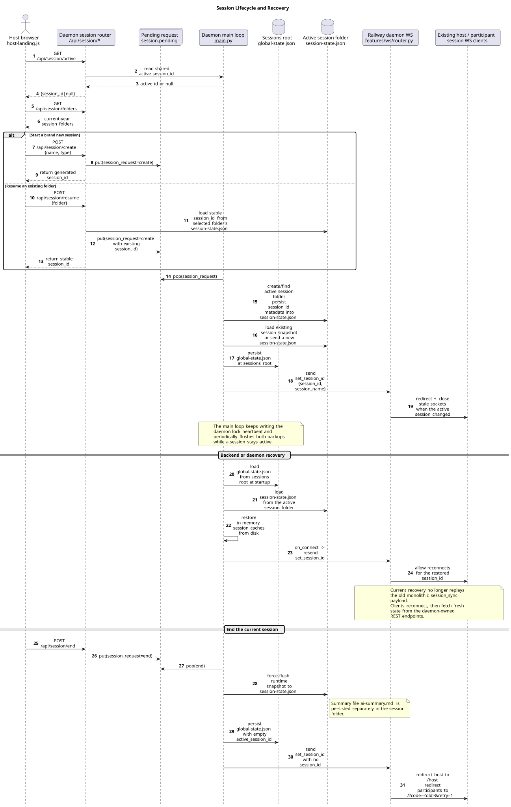

### Participant Join and Geolocation

This diagram covers UUID-based participant registration, session-scoped state bootstrap, presence updates, and optional location sharing back to the host view.

Current code path / behavior family: [`static/participant.js`](static/participant.js), [`daemon/participant/router.py`](daemon/participant/router.py), [`daemon/participant/state.py`](daemon/participant/state.py), [`railway/features/ws/proxy_bridge.py`](railway/features/ws/proxy_bridge.py), [`railway/features/ws/router.py`](railway/features/ws/router.py)

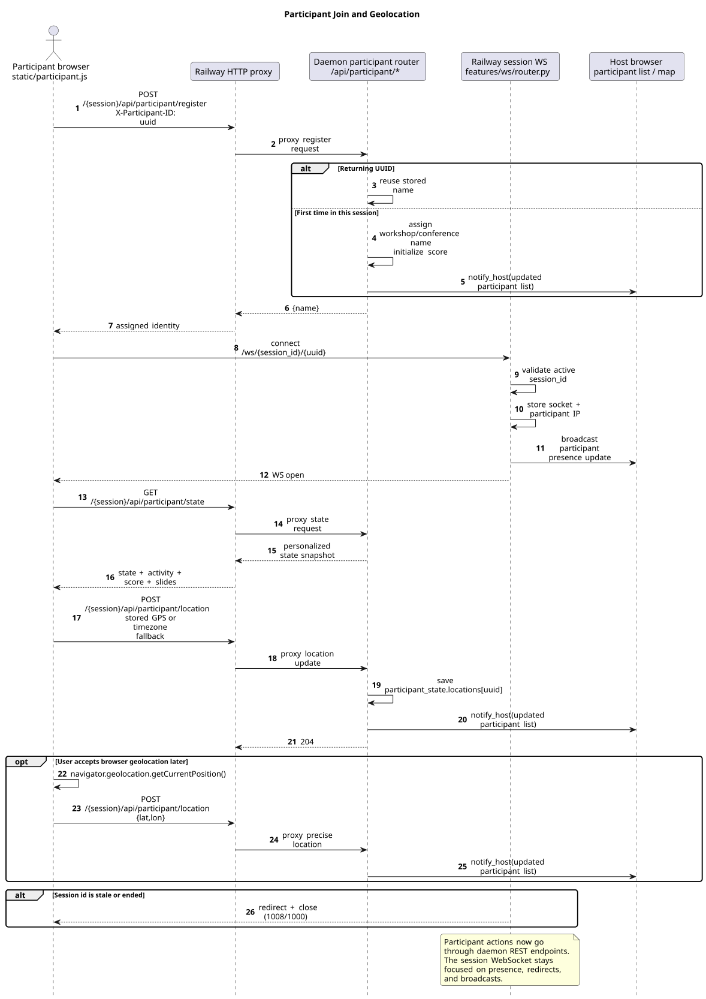

### Poll and Quiz

This diagram covers Claude-backed quiz draft generation plus the live poll lifecycle from host draft/open through participant votes, close, and score reveal.

Current code path / behavior family: [`daemon/quiz/router.py`](daemon/quiz/router.py), [`daemon/quiz/generator.py`](daemon/quiz/generator.py), [`daemon/quiz/history.py`](daemon/quiz/history.py), [`daemon/poll/router.py`](daemon/poll/router.py), [`daemon/poll/state.py`](daemon/poll/state.py)

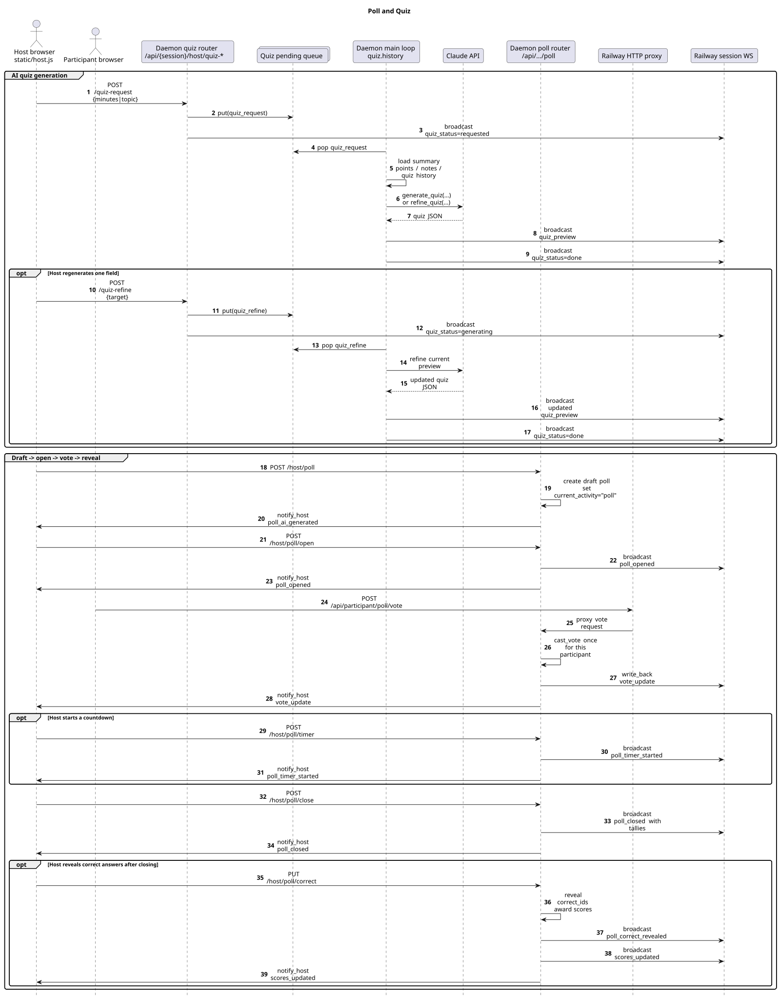

### Q&A and Word Cloud

This diagram covers participant word submissions, anonymous question and upvote flows, host moderation, and the score updates emitted alongside those actions.

Current code path / behavior family: [`daemon/wordcloud/router.py`](daemon/wordcloud/router.py), [`daemon/wordcloud/state.py`](daemon/wordcloud/state.py), [`daemon/qa/router.py`](daemon/qa/router.py), [`daemon/qa/state.py`](daemon/qa/state.py), [`daemon/ws_publish.py`](daemon/ws_publish.py)

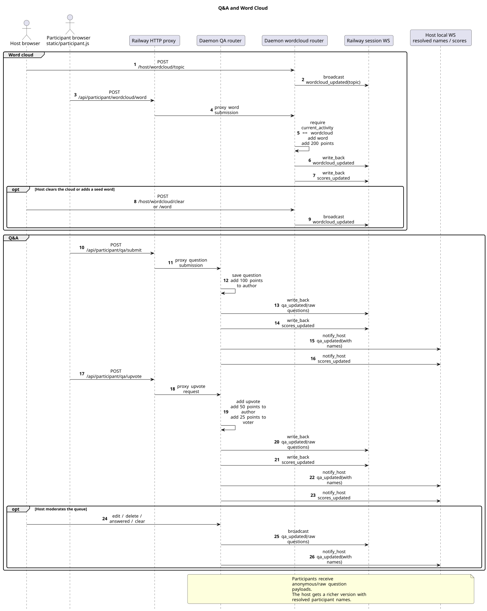

### Code Review and Debate

This diagram covers host-launched code review and debate activities, participant submissions, scoring, and the Claude cleanup step that now only applies to debate arguments.

Current code path / behavior family: [`daemon/codereview/router.py`](daemon/codereview/router.py), [`daemon/codereview/state.py`](daemon/codereview/state.py), [`daemon/debate/router.py`](daemon/debate/router.py), [`daemon/debate/state.py`](daemon/debate/state.py), [`daemon/debate/ai_cleanup.py`](daemon/debate/ai_cleanup.py)

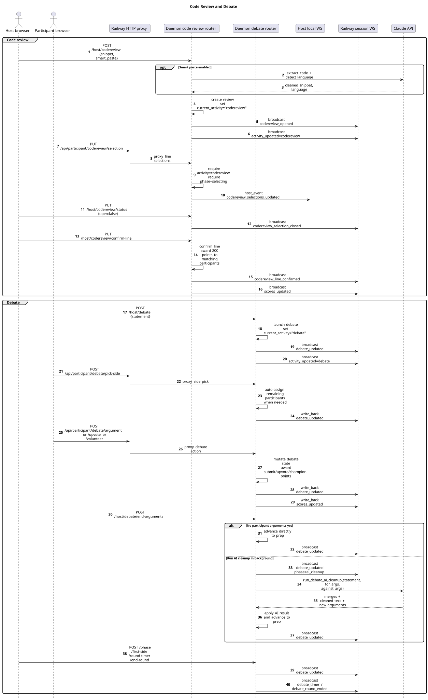

### Slides Cache and Follow Trainer

This diagram covers slide catalog loading, Railway PDF cache fill and refresh, and the live follow-trainer flow driven by PowerPoint events from the local addons bridge.

Current code path / behavior family: [`daemon/slides/loop.py`](daemon/slides/loop.py), [`daemon/slides/router.py`](daemon/slides/router.py), [`daemon/addon_bridge_client.py`](daemon/addon_bridge_client.py), [`railway/features/slides/router.py`](railway/features/slides/router.py), [`railway/features/slides/cache.py`](railway/features/slides/cache.py)

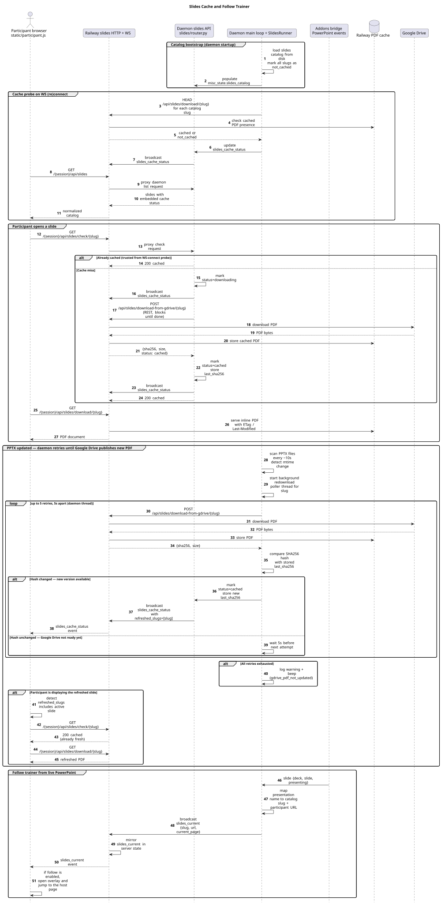

### Participant-to-Host Inputs and Emoji

This diagram covers participant paste and feedback actions, Railway-to-daemon upload handoff, and best-effort emoji delivery to both the host UI and desktop overlay.

Current code path / behavior family: [`daemon/misc/router.py`](daemon/misc/router.py), [`daemon/misc/state.py`](daemon/misc/state.py), [`daemon/emoji/router.py`](daemon/emoji/router.py), [`daemon/upload.py`](daemon/upload.py), [`railway/features/upload/router.py`](railway/features/upload/router.py)

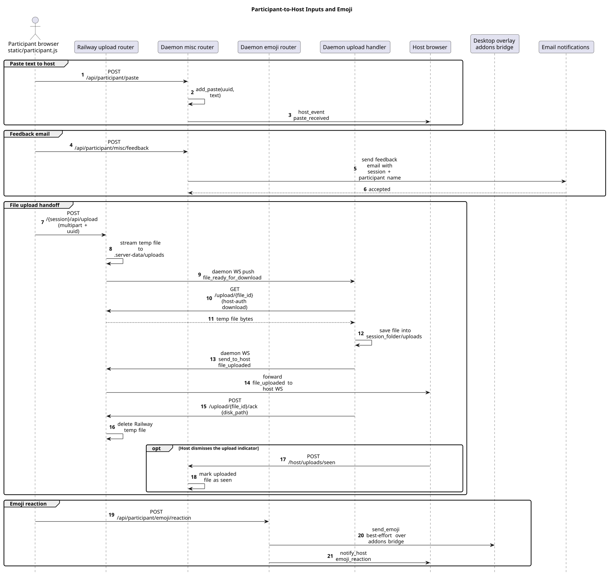

### Activity, Summary, and Leaderboard

This diagram covers activity switching, file-backed notes and summary publication, participant state refreshes, and host-controlled leaderboard reveal and hide.

Current code path / behavior family: [`daemon/activity/router.py`](daemon/activity/router.py), [`daemon/participant/router.py`](daemon/participant/router.py), [`daemon/misc/router.py`](daemon/misc/router.py), [`daemon/summary/loop.py`](daemon/summary/loop.py), [`daemon/leaderboard/router.py`](daemon/leaderboard/router.py)

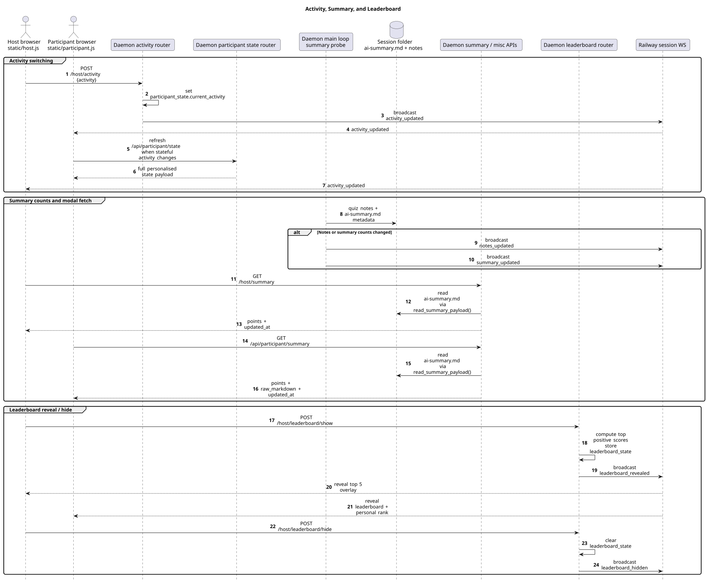

---

## Practical Implications

- If a live feature changes participant or host behavior, the code probably belongs in `daemon/` first, not `railway/`.
- If a change affects participant page bootstrapping, session validation, slide downloads, temporary uploads, or browser/daemon WebSocket transport, it probably belongs in `railway/`.
- If a host bug reproduces only through `http://127.0.0.1:1234/host`, inspect [`daemon/host_server.py`](daemon/host_server.py), the local routers it mounts, and the `proxy_handler` / `ws_publish` bridge before touching Railway.
- If participant behavior and host behavior disagree, check whether the issue is in:
  - the daemon-owned source of truth (`daemon/*/state.py`, `host_state_router.py`, `participant/router.py`)
  - the Railway fan-out layer (`railway/features/ws/*`)
  - a stale static asset that was not synced yet
