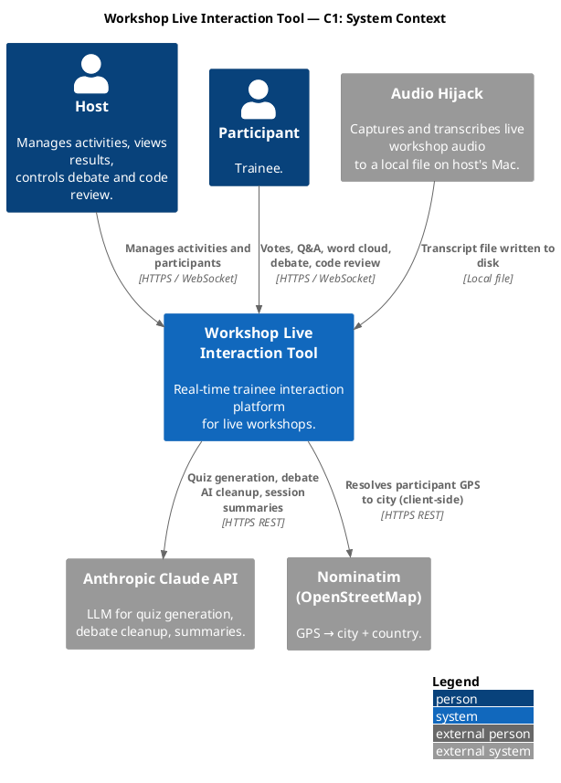
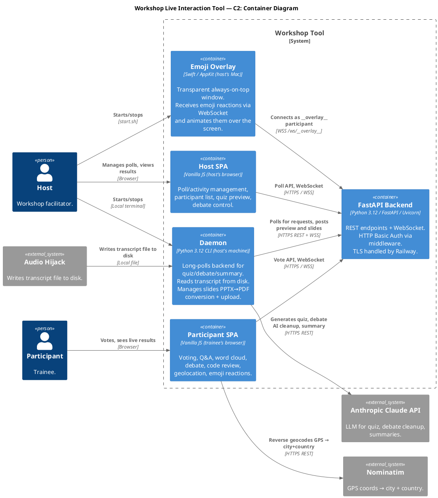

# Architecture Reference

> **This is the go-to document for understanding the system architecture.**
> For product requirements, tech stack, AppState schema, and workflow rules, see [CLAUDE.md](CLAUDE.md).

---

## C1 — System Context

Who uses the system and what external systems it touches.

Source: [`adoc/c4_c1_context.puml`](adoc/c4_c1_context.puml)



---

## C2 — Containers

The five runtime processes and how they communicate.

Source: [`adoc/c4_c2_containers.puml`](adoc/c4_c2_containers.puml)



---

## C3 — Backend Components

All FastAPI routers, the core infrastructure package, and how they connect.

Source: [`adoc/c3_backend.puml`](adoc/c3_backend.puml)

```plantuml
@startuml c3_backend
!include https://raw.githubusercontent.com/plantuml-stdlib/C4-PlantUML/master/C4_Component.puml
title Backend — C3 Component Diagram
LAYOUT_WITH_LEGEND()

Container_Ext(participant_spa, "Participant SPA", "Vanilla JS in trainee's browser")
Container_Ext(host_spa, "Host SPA", "Vanilla JS in host's browser")
Container_Ext(daemon, "Daemon", "Python CLI on host's Mac")
Container_Ext(emoji_overlay, "Emoji Overlay", "Swift app on host's Mac")

Container_Boundary(backend, "FastAPI Backend") {
  Component(core, "core/", "Python package", "state.py (AppState singleton),\nauth.py (HTTP Basic Auth),\nmetrics.py (Prometheus),\nnames.py (conference mode names),\nmessaging.py (registry + broadcast),\nstate_builder.py (core WS state)")
  Component(ws, "features/ws", "FastAPI router", "/ws/{uuid} — participant, host, overlay\n/ws/daemon — daemon heartbeat + slide upload")
  Component(poll, "features/poll", "FastAPI router", "POST /api/poll\nPUT /api/poll/status|correct|timer\nDELETE /api/poll")
  Component(qa, "features/qa", "FastAPI router", "PUT /api/qa/question/{id}/text|answered\nDELETE /api/qa/question/{id}\nPOST /api/qa/clear")
  Component(wordcloud, "features/wordcloud", "FastAPI router", "POST /api/wordcloud/topic|clear")
  Component(codereview, "features/codereview", "FastAPI router", "POST /api/codereview\nPUT /api/codereview/status|confirm-line\nDELETE /api/codereview")
  Component(debate, "features/debate", "FastAPI router", "POST /api/debate + 9 lifecycle endpoints\nGET/POST debate ai-request/ai-result")
  Component(quiz, "features/quiz", "FastAPI router", "POST/GET /api/quiz-request\nPOST /api/quiz-status|preview|refine")
  Component(summary, "features/summary", "FastAPI router", "POST/GET /api/summary\nPOST/GET /api/notes\nPOST/GET /api/summary/force\nPOST /api/transcript-status|token-usage")
  Component(leaderboard, "features/leaderboard", "FastAPI router", "POST /api/leaderboard/show|hide\nDELETE /api/scores")
  Component(slides, "features/slides", "FastAPI router", "POST /api/slides/current\nGET /api/slides/file/{slug}\nPOST /api/slides/upload")
  Component(session, "features/session", "FastAPI router", "POST /api/session/start|end|pause|resume\nPOST /api/session/start_talk|end_talk\nGET /api/session/snapshot|request|folders")
  Component(activity, "features/activity", "FastAPI router", "POST /api/activity")
  Component(pages, "features/pages", "FastAPI router", "GET / → participant.html\nGET /host → host.html\nGET /notes → notes.html")
}

Rel(participant_spa, ws, "WS connect, vote, Q&A, debate, codereview, emoji", "WSS /ws/{uuid}")
Rel(host_spa, ws, "Host WS connection", "WSS /ws/__host__")
Rel(daemon, ws, "Daemon WS (heartbeat + slide upload)", "WSS /ws/daemon")
Rel(emoji_overlay, ws, "WS /ws/__overlay__", "WSS")
Rel(ws, core, "Reads/writes state, dispatches personalized broadcast")
Rel(poll, core, "Poll lifecycle, scoring")
Rel(qa, core, "Q&A questions lifecycle")
Rel(wordcloud, core, "Word cloud state")
Rel(codereview, core, "Code review lifecycle")
Rel(debate, core, "Debate lifecycle")
Rel(quiz, core, "Quiz pipeline state")
Rel(summary, core, "Summary points, notes, transcript")
Rel(leaderboard, core, "Leaderboard visibility, score reset")
Rel(slides, core, "Slides list, slides_current")
Rel(session, core, "Full state snapshot + restore")
@enduml
```

---

## C3 — Daemon Components

All internal modules of the training daemon that runs on the host's Mac.

Source: [`adoc/c3_host_daemon.puml`](adoc/c3_host_daemon.puml)

Key sub-systems:

| Sub-system | Modules | Role |
|---|---|---|
| **Orchestrator** | `daemon/__main__` | Starts all loops; exit code 42 triggers git pull + restart |
| **Quiz pipeline** | `quiz/generator`, `quiz/history`, `quiz/poll_api` | Reads transcript → LLM → posts preview to backend |
| **Debate AI** | `debate/ai_cleanup` | Deduplicates and suggests arguments via LLM |
| **Summary** | `summary/summarizer`, `summary/loop` | Delta-based key-point extraction from transcript |
| **Transcript** | `transcript/normalizer`, `parser`, `loader`, `writer`, `timestamps`, `loop` | Normalizes raw transcript → daily files; injects timestamps |
| **Slides** | `slides/catalog`, `convert`, `drive_sync`, `upload`, `loop`, `daemon` | PPTX→PDF via LibreOffice/PowerPoint; uploads to backend |
| **RAG** | `rag/indexer`, `rag/retriever`, `rag/project_files` | Indexes project files; enriches quiz generation context |
| **Session state** | `daemon/session_state` | Reads/writes global state + per-session JSON to disk |
| **LLM adapter** | `daemon/llm/adapter` | Claude API wrapper with token counting |

```plantuml
@startuml c3_host_daemon
!include https://raw.githubusercontent.com/plantuml-stdlib/C4-PlantUML/master/C4_Component.puml
title Daemon — C3 Component Diagram
LAYOUT_WITH_LEGEND()

Container_Ext(fastapi, "FastAPI Backend", "HTTPS REST + WSS")
Container_Ext(claude_api, "Anthropic Claude API", "HTTPS REST")
System_Ext(audio_hijack, "Audio Hijack", "Writes transcript file to disk")
System_Ext(google_drive, "Google Drive", "HTTPS REST")

Container_Boundary(daemon_pkg, "Daemon (Python 3.12, host's Mac)") {
  Component(main, "daemon/__main__", "Orchestrator", "Starts all background loops.\nExit code 42 → git pull + restart.\nOn WS reconnect: re-syncs active session to backend.")
  Component(quiz_gen, "daemon/quiz/generator", "Quiz generator", "Reads transcript or topic, calls LLM.")
  Component(quiz_api, "daemon/quiz/poll_api", "Quiz poll API", "Polls /api/quiz-request; posts preview.")
  Component(debate_ai, "daemon/debate/ai_cleanup", "Debate AI cleanup", "Deduplicates, fixes typos, suggests new arguments.")
  Component(summarizer, "daemon/summary/summarizer", "Summarizer", "Delta-based key-point extraction (two-tier: notes + discussion).")
  Component(summary_loop, "daemon/summary/loop", "Summary loop", "Polls /api/summary/force.")
  Component(transcript_normalizer, "daemon/transcript/normalizer", "Transcript normalizer", "Normalizes raw transcript into daily YYYY-MM-DD files.")
  Component(transcript_timestamps, "daemon/transcript/timestamps", "Timestamp injector", "Auto-appends [HH:MM:SS] markers every ~3s.")
  Component(transcript_loader, "daemon/transcript/loader", "Transcript loader", "Reads last N minutes from normalized files.")
  Component(slides_loop, "daemon/slides/loop", "Slides loop", "Watches catalog; triggers convert + upload pipeline.")
  Component(slides_upload, "daemon/slides/upload", "Slides uploader", "Uploads converted PDFs to backend via WSS.")
  Component(llm, "daemon/llm/adapter", "LLM adapter", "Claude API wrapper, token counting & cost tracking.")
  Component(session_state, "daemon/session_state", "Session + global state", "training-assistant-global-state.json + session_state.json per folder.")
  Component(rag_retriever, "daemon/rag/retriever", "RAG retriever", "Retrieves relevant context for quiz generation.")
}

Rel(main, transcript_normalizer, "starts loop")
Rel(main, summary_loop, "starts")
Rel(main, slides_loop, "starts")
Rel(main, session_state, "starts polling loop")
Rel(quiz_api, fastapi, "polls quiz-request; posts preview", "HTTPS")
Rel(quiz_gen, transcript_loader, "reads last N minutes")
Rel(quiz_gen, rag_retriever, "enriches context")
Rel(quiz_gen, llm, "LLM call")
Rel(debate_ai, fastapi, "polls ai-request; posts ai-result", "HTTPS")
Rel(debate_ai, llm, "LLM call")
Rel(summary_loop, fastapi, "polls summary/force; posts summary", "HTTPS")
Rel(summarizer, transcript_loader, "reads transcript")
Rel(summarizer, llm, "LLM call")
Rel(slides_upload, fastapi, "uploads PDF via WSS", "WSS /ws/daemon")
Rel(session_state, fastapi, "GET snapshot; POST sync", "HTTPS")
Rel(llm, claude_api, "claude-haiku / claude-sonnet", "HTTPS")
Rel(audio_hijack, transcript_normalizer, "Writes raw transcript", "Local file")
@enduml
```

---

## C3 — Desktop Overlay & Wispr Addons

Source: [`adoc/c3_desktop_overlay.puml`](adoc/c3_desktop_overlay.puml)

**Emoji Overlay** (Swift / AppKit): connects to the backend as `__overlay__` via WebSocket, animates emoji reactions floating over the screen. Transparent always-on-top NSPanel; PID lock ensures a single instance.

**Wispr Addons** (`wispr-addons/clean.py`): Python daemon using CGEventTap to intercept keyboard/mouse events. Captures Cmd+V pastes; Cmd+Ctrl+V sends clipboard to Claude Haiku for grammar cleanup and re-pastes; Mouse Button 5 mutes dictation volume.

---

## Messaging Registry Pattern

Source: [`docs/messaging-registry.md`](docs/messaging-registry.md)

### Problem & Solution

`core/messaging.py` owns only the WebSocket broadcast infrastructure. Each feature registers its own state-serialization logic at import time via `register_state_builder(name, for_participant_fn, for_host_fn)`. On every broadcast, the registry merges all feature contributions into one state payload.

```
┌─────────────────────────────────────────────────────────┐
│                    core/messaging.py                    │
│  register_state_builder(feature, for_participant, ...)  │
│  build_participant_state(pid) → merges all builders     │
│  build_host_state()          → merges all builders      │
│  broadcast_state() / broadcast() / send_*()             │
└─────────────────────────────────────────────────────────┘
         ▲ registered at import time by each feature
         │
  ┌──────┴──────┬──────────────┬──────────────┬──────────────┐
  │             │              │              │              │
poll/       qa/          debate/       codereview/    leaderboard/
state_      state_        state_        state_         state_
builder.py  builder.py    builder.py    builder.py     builder.py
  │             │              │              │              │
wordcloud/  slides/        features/
state_      state_         core_state_
builder.py  builder.py     builder.py
```

### How to Add a New Feature

1. Create `features/myfeature/state_builder.py` with `build_for_participant(pid)` and `build_for_host()`.
2. At the bottom of the file: `from core.messaging import register_state_builder; register_state_builder("myfeature", build_for_participant, build_for_host)`.
3. Import the file somewhere in the startup path (e.g. feature `__init__.py` or `main.py`).
4. No changes to `core/messaging.py`.

### State Builder Responsibilities

| File | Participant keys | Host-only extras |
|---|---|---|
| `features/core_state_builder.py` | type, backend_version, mode, my_score, my_avatar, my_name, current_activity, participant_count, host_connected, summary_*, notes_content, screen_share_active | participants list, overlay_connected, daemon_*, quiz_preview, token_usage, transcript_*, needs_restore, pending_deploy |
| `features/poll/state_builder.py` | poll, poll_active, poll_timer_*, vote_counts, my_vote, poll_correct_ids | same without my_vote |
| `features/qa/state_builder.py` | qa_questions (with is_own, has_upvoted) | qa_questions (without personal fields) |
| `features/wordcloud/state_builder.py` | wordcloud_words, wordcloud_word_order, wordcloud_topic | same |
| `features/codereview/state_builder.py` | codereview (with my_selections, line_percentages) | codereview (with line_counts, line_participants) |
| `features/debate/state_builder.py` | debate_* (with my_side, is_own, has_upvoted, my_is_champion, auto_assigned) | debate_* (without personal fields) |
| `features/leaderboard/state_builder.py` | leaderboard_active, leaderboard_data (with your_rank, your_score) | leaderboard_active, top5 only |
| `features/slides/state_builder.py` | slides_current, session_main, session_talk, session_name | same |

---

## Daemon Persisted State

Source: [`docs/daemon-persisted-state.md`](docs/daemon-persisted-state.md)

### Disk Layout

- `sessions_root` = `SESSIONS_FOLDER` env var, default: `~/My Drive/Cursuri/###sesiuni`
- Global file: `${sessions_root}/training-assistant-global-state.json` — contains `session_id` of the currently active session
- Per-session: `${sessions_root}/${session_name}/session_state.json` — full serialized backend snapshot

```mermaid
classDiagram
    class SessionsRoot {
      +path: SESSIONS_FOLDER
    }
    class GlobalStateFile {
      +path: training-assistant-global-state.json
      +main: SessionRef?
      +talk: SessionRef?
      +session_id: string?
    }
    class SessionRef {
      +name: string
      +started_at: iso-datetime
      +ended_at: iso-datetime?
      +status: active|paused|ended
      +paused_intervals: PauseInterval[]
    }
    class PauseInterval {
      +from: iso-datetime
      +to: iso-datetime?
      +reason: explicit|nested|day_end
    }
    class SessionFolder {
      +name: string
      +path: /sessions_root/{name}
    }
    class SessionStateFile {
      +path: session_state.json
      +saved_at: iso-datetime
      +session_id: string
      +mode: workshop|conference
      +participants: map
      +activity: none|poll|wordcloud|qa|debate|codereview
      +poll: object?
      +qa: object
      +wordcloud: object
      +debate: object
      +codereview: object
      +leaderboard_active: bool
      +token_usage: object
      +slides_log: list
      +git_repos: list
    }

    SessionsRoot "1" o-- "1" GlobalStateFile : stores global
    SessionsRoot "1" o-- "*" SessionFolder : contains
    SessionFolder "1" o-- "1" SessionStateFile : stores per-session
    GlobalStateFile "1" --> "0..1" SessionRef : main
    GlobalStateFile "1" --> "0..1" SessionRef : talk
    SessionRef "1" o-- "*" PauseInterval
```

### Session Restore on Backend Restart

On daemon WS reconnect, the daemon re-sends `session_sync` with the full `session_state.json`. The backend restores all in-memory state (participants, scores, activity, poll/qa/debate/codereview) from this snapshot.

---

## System Interactions (Sequence Flows)

Full sequence diagram: [`docs/system-interactions.puml`](docs/system-interactions.puml)

The diagram covers 19 interaction flows:

| # | Flow | Key participants |
|---|---|---|
| 1 | Session lifecycle (start / pause / resume / end) | Host UI → Backend → Daemon |
| 2 | Participant join + geolocation | Participant UI → Backend → Host UI |
| 3 | Poll / Quiz flow | Host → Backend ↔ Daemon → Claude API |
| 4 | Q&A submit + upvote | Participant WS → Backend broadcast |
| 5 | Word cloud | Host → Backend ← Participant WS |
| 6 | Code review (smart paste, line select, confirm) | Host → Backend (→ Claude Haiku) ↔ Participant |
| 7 | Debate (sides, arguments, AI cleanup, volunteers, round timer) | Participant WS → Backend ↔ Daemon → Claude |
| 8 | Slide invalidation (PPTX change detected) | Daemon WS → Backend → Google Drive → Participant |
| 9 | Slide loading (PDF serve / cache) | Participant HTTP → Backend (→ Google Drive) |
| 10 | Follow trainer (PowerPoint probe) | Daemon WS → Backend → Participant |
| 11 | Paste text (participant → host) | Participant WS → Backend → Host WS |
| 12 | File upload | Participant HTTP → Backend → Host WS |
| 13 | Emoji reaction | Participant WS → Backend → Desktop Overlay WS |
| 14 | Activity switch | Host REST → Backend broadcast |
| 15 | Mode switch (workshop / conference) | Host REST → Backend broadcast |
| 16 | Summary / key points | Host or Participant → Backend WS → Daemon → Claude |
| 17 | Leaderboard show/hide | Host REST → Backend → Participant (personalized rank) |
| 18 | Daemon heartbeat & periodic state persistence | Daemon ↔ Backend every 7s |
| 19 | Backend restart recovery | Daemon WS reconnect → session_sync → full restore |
