# Messaging Registry Architecture

## Problem Solved

The original `messaging.py` (511 lines) was a monolith: it contained both broadcast
infrastructure (WebSocket send logic) and the full serialization logic for every feature
(poll, Q&A, word cloud, code review, debate, leaderboard, slides, and core/infra fields).
Adding a new feature meant editing this central file, which created a coupling bottleneck and
made the file grow unboundedly.

## Solution: Registry Pattern

`core/messaging.py` now owns only the broadcast infrastructure. Each feature registers its
own state-serialization logic at import time. When a broadcast happens, the registry merges
all feature contributions into one state message.

```
┌─────────────────────────────────────────────────────────┐
│                    core/messaging.py                    │
│  register_state_builder(feature, for_participant, ...)  │
│  build_participant_state(pid) → merges all builders     │
│  build_host_state()          → merges all builders      │
│  broadcast_state() / broadcast() / send_*()             │
└─────────────────────────────────────────────────────────┘
         ▲ registered at import time by each feature
         │
  ┌──────┴──────┬──────────────┬──────────────┬──────────────┐
  │             │              │              │              │
poll/       qa/          debate/       codereview/    leaderboard/
state_      state_        state_        state_         state_
builder.py  builder.py    builder.py    builder.py     builder.py
  │             │              │              │              │
wordcloud/  slides/        features/
state_      state_         core_state_
builder.py  builder.py     builder.py
```

## Architecture Diagram

```mermaid
graph TD
    CM[core/messaging.py\nregistry + broadcast]

    CM -->|calls| BP[build_participant_state pid]
    CM -->|calls| BH[build_host_state]

    BP -->|merges| core_p[core_state_builder\nbuild_for_participant]
    BP -->|merges| poll_p[poll/state_builder\nbuild_for_participant]
    BP -->|merges| qa_p[qa/state_builder\nbuild_for_participant]
    BP -->|merges| wc_p[wordcloud/state_builder\nbuild_for_participant]
    BP -->|merges| cr_p[codereview/state_builder\nbuild_for_participant]
    BP -->|merges| deb_p[debate/state_builder\nbuild_for_participant]
    BP -->|merges| lb_p[leaderboard/state_builder\nbuild_for_participant]
    BP -->|merges| sl_p[slides/state_builder\nbuild_for_participant]

    BH -->|merges| core_h[core_state_builder\nbuild_for_host]
    BH -->|merges| poll_h[poll/state_builder\nbuild_for_host]
    BH -->|merges| qa_h[qa/state_builder\nbuild_for_host]
    BH -->|merges| wc_h[wordcloud/state_builder\nbuild_for_host]
    BH -->|merges| cr_h[codereview/state_builder\nbuild_for_host]
    BH -->|merges| deb_h[debate/state_builder\nbuild_for_host]
    BH -->|merges| lb_h[leaderboard/state_builder\nbuild_for_host]
    BH -->|merges| sl_h[slides/state_builder\nbuild_for_host]

    poll_p -->|register_state_builder| CM
    qa_p -->|register_state_builder| CM
    wc_p -->|register_state_builder| CM
    cr_p -->|register_state_builder| CM
    deb_p -->|register_state_builder| CM
    lb_p -->|register_state_builder| CM
    sl_p -->|register_state_builder| CM
    core_p -->|register_state_builder| CM
```



## How Registration Works

Each `state_builder.py` file calls `register_state_builder` at module level (bottom of file):

```python
# features/poll/state_builder.py

from state import state

def build_for_participant(pid: str) -> dict:
    return {
        "poll": state.poll,
        "poll_active": state.poll_active,
        "vote_counts": state.vote_counts(),
        "my_vote": state.votes.get(pid),
        # ...
    }

def build_for_host() -> dict:
    return {
        "poll": state.poll,
        "poll_active": state.poll_active,
        "vote_counts": state.vote_counts(),
        # ...
    }

from messaging import register_state_builder
register_state_builder("poll", build_for_participant, build_for_host)
```

The module-level `register_state_builder` call fires as soon as the module is imported. The
main application imports each `state_builder.py` once (directly or via its feature package),
after which the registry is fully populated.

## How to Add a New Feature

1. Create `features/myfeature/state_builder.py` with:
   - `build_for_participant(pid: str) -> dict` — keys/values for participant WebSocket state
   - `build_for_host() -> dict` — keys/values for host WebSocket state
   - At the bottom: `from messaging import register_state_builder; register_state_builder("myfeature", build_for_participant, build_for_host)`

2. Import the new state_builder somewhere in the startup path so the registration fires
   (e.g. in the feature's `__init__.py`, or directly in `main.py`).

3. No changes needed to `core/messaging.py`.

## Builder Responsibilities by Feature

| File | Participant keys | Host keys |
|---|---|---|
| `features/core_state_builder.py` | type, backend_version, mode, my_score, my_avatar, my_name, current_activity, participant_count, host_connected, summary_*, notes_content, screen_share_active | + participants list, overlay_connected, daemon_*, quiz_preview, token_usage, transcript_*, needs_restore, pending_deploy |
| `features/poll/state_builder.py` | poll, poll_active, poll_timer_*, vote_counts, my_vote, poll_correct_ids, my_voted_ids | poll, poll_active, poll_timer_*, vote_counts |
| `features/qa/state_builder.py` | qa_questions (with is_own, has_upvoted) | qa_questions (without personal fields) |
| `features/wordcloud/state_builder.py` | wordcloud_words, wordcloud_word_order, wordcloud_topic | same |
| `features/codereview/state_builder.py` | codereview (with my_selections, line_percentages) | codereview (with line_counts, line_participants) |
| `features/debate/state_builder.py` | debate_* (with my_side, is_own, has_upvoted, my_is_champion, auto_assigned) | debate_* (without personal fields) |
| `features/leaderboard/state_builder.py` | leaderboard_active, leaderboard_data (with your_rank, your_score, your_name) | leaderboard_active, leaderboard_data (top5 only) |
| `features/slides/state_builder.py` | slides_current, session_main, session_talk, session_name | same |

## Notes on Ordering

The registry is a plain dict — insertion order is preserved (Python 3.7+). The `core`
builder is registered first and sets `type: "state"`. Feature builders are merged in with
`dict.update()`, so later registrations can technically overwrite earlier keys. Avoid
duplicate keys across builders.

## Import Path Note

During Phase 4, all state_builder files use `from state import state` and
`from messaging import register_state_builder` (original paths). Phase 6 will update these
to `from core.state import state` and `from core.messaging import register_state_builder`
once all imports are consolidated.
