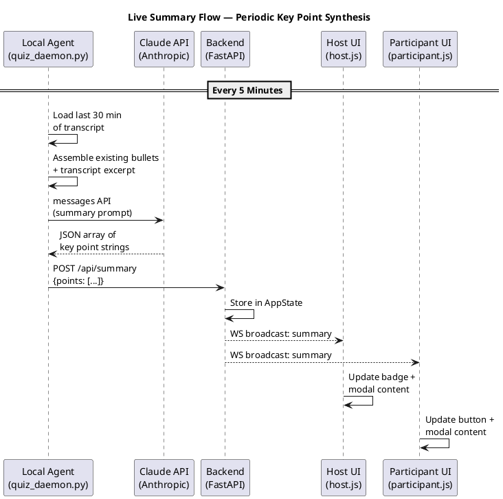

# Live Session Summary Implementation Plan

> **For agentic workers:** REQUIRED SUB-SKILL: Use superpowers:subagent-driven-development (recommended) or superpowers:executing-plans to implement this plan task-by-task. Steps use checkbox (`- [ ]`) syntax for tracking.

**Goal:** Daemon periodically synthesizes key discussion points from the live transcript and pushes them to both host and participant UIs as a read-only bullet list accessible via modal.

**Architecture:** The daemon (host's Mac) runs a background summarization loop every 5 minutes. It reads the last 30 min of transcript + existing bullets, calls Claude API to produce updated key points, and POSTs them to a new `/api/summary` endpoint on the FastAPI backend. The backend stores bullets in AppState and broadcasts to all connected clients via WebSocket. Both UIs display a button that opens a read-only modal with the bullets.

**Tech Stack:** Python (FastAPI, Anthropic SDK), Vanilla JS, WebSocket

**Ref:** GitHub Issue #20

---

## File Structure

| File | Action | Responsibility |
|---|---|---|
| `state.py` | Modify | Add `summary_points` and `summary_updated_at` fields to AppState |
| `messaging.py` | Modify | Include summary fields in `build_state_message()` |
| `routers/summary.py` | Create | New router: `POST /api/summary` (host-auth) |
| `main.py` | Modify | Register summary router with host auth |
| `daemon/summarizer.py` | Create | Summary generation logic: load transcript, call Claude, return bullets |
| `quiz_daemon.py` | Modify | Add periodic summary loop in the main daemon loop |
| `static/participant.html` | Modify | Add summary button in status bar |
| `static/participant.js` | Modify | Handle summary state, render modal |
| `static/common.css` | Modify | Summary modal styles (shared by both UIs) |
| `static/host.html` | Modify | Add summary button in status badges area |
| `static/host.js` | Modify | Handle summary state, render modal |
| `test_main.py` | Modify | Add tests for `/api/summary` endpoint |

---

### Task 1: Backend State + API Endpoint

**Files:**
- Modify: `state.py:27-49` (add fields in `reset()`)
- Create: `routers/summary.py`
- Modify: `main.py:13,26` (import + register router)
- Modify: `messaging.py:14-52` (include summary in state message)

- [ ] **Step 1: Write failing test for POST /api/summary**

Add to `test_main.py`:

```python
def test_post_summary_updates_state():
    """POST /api/summary stores bullets and broadcasts via full state."""
    session = WorkshopSession()
    # POST summary first (before connecting participant)
    resp = session._client.post(
        "/api/summary",
        json={"points": ["Discussed TDD basics", "Covered mocking patterns"]},
    )
    assert resp.status_code == 200
    assert resp.json()["ok"] is True

    # Participant connects and receives initial state with summary included
    with session.participant("Alice") as alice:
        assert "summary_points" in alice._last_state
        assert len(alice._last_state["summary_points"]) == 2
        assert alice._last_state["summary_points"][0] == "Discussed TDD basics"


def test_post_summary_requires_auth():
    """POST /api/summary without auth returns 401."""
    client = TestClient(app)  # no auth headers
    resp = client.post(
        "/api/summary",
        json={"points": ["Should fail"]},
    )
    assert resp.status_code == 401
```

- [ ] **Step 2: Run tests to verify they fail**

Run: `python3 -m pytest test_main.py::test_post_summary_updates_state test_main.py::test_post_summary_requires_auth -v`
Expected: FAIL (404 — route not found)

- [ ] **Step 3: Add summary fields to AppState**

In `state.py`, add to `reset()` after the `qa_questions` line:

```python
self.summary_points: list[str] = []
self.summary_updated_at: Optional[datetime] = None
```

- [ ] **Step 4: Create routers/summary.py**

```python
from datetime import datetime, timezone

from fastapi import APIRouter
from pydantic import BaseModel

from messaging import broadcast, build_state_message
from state import state

router = APIRouter()


class SummaryUpdate(BaseModel):
    points: list[str]


@router.post("/api/summary")
async def update_summary(body: SummaryUpdate):
    state.summary_points = body.points
    state.summary_updated_at = datetime.now(timezone.utc)
    await broadcast(build_state_message())
    return {"ok": True}
```

- [ ] **Step 5: Register router in main.py**

In `main.py`, add import:
```python
from routers import ws, poll, scores, quiz, pages, wordcloud, activity, qa, summary
```

Add after the `qa` router line:
```python
app.include_router(summary.router, dependencies=[Depends(require_host_auth)])
```

- [ ] **Step 6: Include summary in build_state_message()**

In `messaging.py`, add these fields to the dict returned by `build_state_message()`, after `"qa_questions"`:

```python
"summary_points": state.summary_points,
"summary_updated_at": state.summary_updated_at.isoformat() if state.summary_updated_at else None,
```

- [ ] **Step 7: Run tests to verify they pass**

Run: `python3 -m pytest test_main.py -v`
Expected: ALL PASS

- [ ] **Step 8: Commit**

```bash
git add state.py routers/summary.py main.py messaging.py test_main.py
git commit -m "feat: add /api/summary endpoint and state fields"
```

---

### Task 2: Daemon Summarizer Module

**Files:**
- Create: `daemon/summarizer.py`

- [ ] **Step 1: Create daemon/summarizer.py**

This module contains the Claude API call logic for generating summary bullets. It reuses `load_transcription_files` and `extract_last_n_minutes` from `quiz_core.py`.

```python
"""
Summarizer — generates key discussion points from live transcript.

Called periodically by the daemon. Reads last 30 min of transcript +
existing bullet list, calls Claude to synthesize updated key points.
"""

import json
import sys
from pathlib import Path
from typing import Optional

import anthropic

from quiz_core import (
    Config,
    load_transcription_files,
    extract_last_n_minutes,
    read_session_notes,
)

SUMMARY_INTERVAL_SECONDS = 5 * 60  # 5 minutes
SUMMARY_TRANSCRIPT_MINUTES = 30

_SUMMARY_SYSTEM_PROMPT = """\
You are a workshop summarizer. You receive the transcript of the last portion of a live technical workshop, \
and optionally a list of key points that were previously identified.

Your job is to produce an updated list of key discussion points — concise bullets that capture \
what was discussed, decided, or demonstrated.

Rules:
- Each bullet should be ONE concise sentence (max 15 words).
- Keep bullets in chronological order of when the topic was discussed.
- If existing bullets are provided, preserve ones that are still relevant, update ones that evolved, \
and add new ones for newly discussed topics.
- Remove bullets that are no longer relevant (e.g., a topic that was briefly mentioned but moved on from).
- Aim for 5-15 bullets total. Fewer is better if the session is short.
- Ignore transcription noise, filler words, and off-topic chatter.
- Focus on technical content, decisions, and key takeaways.

Return ONLY a JSON array of strings. No markdown, no explanation.
Example: ["Introduced TDD red-green-refactor cycle", "Compared mockist vs classicist testing styles"]
"""


def generate_summary(
    config: Config,
    existing_points: list[str],
) -> Optional[list[str]]:
    """Generate updated summary points from transcript + existing bullets.

    Returns updated list of bullet strings, or None on failure.
    """
    try:
        entries = load_transcription_files(config.folder)
    except SystemExit:
        print("[summarizer] No transcription files found — skipping", file=sys.stderr)
        return None

    if not entries:
        return None

    text = extract_last_n_minutes(entries, SUMMARY_TRANSCRIPT_MINUTES)
    if not text:
        return None

    # Include session notes if available
    notes = read_session_notes(config)

    # Build user message
    parts = []
    if notes:
        parts.append(f"SESSION NOTES (trainer's agenda):\n{notes}\n")
    if existing_points:
        parts.append(f"EXISTING KEY POINTS:\n{json.dumps(existing_points, indent=2)}\n")
    parts.append(f"TRANSCRIPT (last {SUMMARY_TRANSCRIPT_MINUTES} minutes):\n{text}")

    user_message = "\n---\n".join(parts)

    try:
        client = anthropic.Anthropic(api_key=config.api_key)
        response = client.messages.create(
            model=config.model,
            max_tokens=1024,
            system=_SUMMARY_SYSTEM_PROMPT,
            messages=[{"role": "user", "content": user_message}],
        )

        response_text = response.content[0].text.strip()
        # Parse JSON array from response
        points = json.loads(response_text)
        if isinstance(points, list) and all(isinstance(p, str) for p in points):
            print(f"[summarizer] Generated {len(points)} key points")
            return points
        else:
            print(f"[summarizer] Unexpected response format: {response_text[:200]}", file=sys.stderr)
            return None

    except json.JSONDecodeError as e:
        print(f"[summarizer] Failed to parse Claude response as JSON: {e}", file=sys.stderr)
        return None
    except anthropic.APIError as e:
        print(f"[summarizer] Claude API error: {e}", file=sys.stderr)
        return None
    except Exception as e:
        print(f"[summarizer] Unexpected error: {e}", file=sys.stderr)
        return None
```

- [ ] **Step 2: Verify module imports correctly**

Run: `cd /Users/victorrentea/conductor/workspaces/training-assistant/douala && python3 -c "from daemon.summarizer import generate_summary, SUMMARY_INTERVAL_SECONDS; print('OK')"`
Expected: `OK`

- [ ] **Step 3: Commit**

```bash
git add daemon/summarizer.py
git commit -m "feat: add daemon summarizer module for key point generation"
```

---

### Task 3: Integrate Summarizer into Daemon Loop

**Files:**
- Modify: `quiz_daemon.py:175-308` (add summary loop in `run()`)

- [ ] **Step 1: Add summary imports and state to quiz_daemon.py**

Add imports at top (after existing imports):
```python
from daemon.summarizer import generate_summary, SUMMARY_INTERVAL_SECONDS
```

Also add `_post_json` to the existing `quiz_core` import (line 31-34) — it is already defined in `quiz_core.py` but not currently imported by the daemon:
```python
from quiz_core import (
    config_from_env, find_session_folder, auto_generate, auto_generate_topic, auto_refine,
    post_status, _get_json, _post_json, DAEMON_POLL_INTERVAL,
)
```

- [ ] **Step 2: Add summary state variables in run()**

After `last_heartbeat_at = 0.0` (line 218), add:
```python
# Summary state
summary_points: list[str] = []
last_summary_at = 0.0  # monotonic time of last summary run
```

- [ ] **Step 3: Add summary tick in the main loop**

Inside the `while True:` / `try:` block, after the refine request section (after line 295) and before the `except RuntimeError` (line 297), add:

```python
            # ── Periodic summary generation ──
            now_mono = time.monotonic()
            if now_mono - last_summary_at >= SUMMARY_INTERVAL_SECONDS:
                last_summary_at = now_mono
                try:
                    new_points = generate_summary(config, summary_points)
                    if new_points is not None:
                        summary_points = new_points
                        _post_json(
                            f"{config.server_url}/api/summary",
                            {"points": summary_points},
                            config.host_username, config.host_password,
                        )
                except Exception as e:
                    print(f"[summarizer] Error during summary generation: {e}", file=sys.stderr)
```

- [ ] **Step 4: Test daemon starts without errors**

Run: `cd /Users/victorrentea/conductor/workspaces/training-assistant/douala && python3 -c "import quiz_daemon; print('imports OK')"`
Expected: `imports OK`

- [ ] **Step 5: Commit**

```bash
git add quiz_daemon.py
git commit -m "feat: integrate periodic summary generation into daemon loop"
```

---

### Task 4: Participant UI — Summary Button + Modal

**Files:**
- Modify: `static/participant.html:34-38` (add button in status bar)
- Modify: `static/participant.js` (handle summary state, render modal)
- Modify: `static/participant.css` (modal styles)

- [ ] **Step 1: Add summary button in participant.html**

In the `.status-right` span (line 34), add before the notification button:
```html
<button id="summary-btn" title="Key points discussed" style="display:none" onclick="toggleSummaryModal()">📋</button>
```

Add the summary modal before the closing `</body>` (before the `<script>` tags, after `<div id="main-screen">`):
```html
<div id="summary-overlay" class="summary-overlay" onclick="closeSummaryModal()">
  <div class="summary-dialog" onclick="event.stopPropagation()">
    <div class="summary-header">
      <span>📋 Key Points</span>
      <button class="summary-close" onclick="closeSummaryModal()">✕</button>
    </div>
    <ul id="summary-list" class="summary-list"></ul>
    <div id="summary-time" class="summary-time"></div>
  </div>
</div>
```

- [ ] **Step 2: Add summary JS logic in participant.js**

Add near the top with other state variables:
```javascript
let summaryPoints = [];
let summaryUpdatedAt = null;
```

Add summary rendering functions:
```javascript
function updateSummary(points, updatedAt) {
  summaryPoints = points || [];
  summaryUpdatedAt = updatedAt;
  const btn = document.getElementById('summary-btn');
  if (btn) btn.style.display = summaryPoints.length ? '' : 'none';
  renderSummaryList();
}

function renderSummaryList() {
  const list = document.getElementById('summary-list');
  const timeEl = document.getElementById('summary-time');
  if (!list) return;
  if (!summaryPoints.length) {
    list.innerHTML = '<li class="summary-empty">No key points yet — check back soon.</li>';
    if (timeEl) timeEl.textContent = '';
    return;
  }
  list.innerHTML = summaryPoints.map(p => `<li>${escHtml(p)}</li>`).join('');
  if (timeEl && summaryUpdatedAt) {
    const d = new Date(summaryUpdatedAt);
    timeEl.textContent = 'Updated ' + d.toLocaleTimeString();
  }
}

function toggleSummaryModal() {
  const overlay = document.getElementById('summary-overlay');
  if (overlay) overlay.classList.toggle('open');
}

function closeSummaryModal() {
  const overlay = document.getElementById('summary-overlay');
  if (overlay) overlay.classList.remove('open');
}
```

In the `handleMessage` switch statement (line 274), inside `case 'state':` block, add after the activity rendering (after line 321, before the `break` at line 322):
```javascript
        updateSummary(msg.summary_points, msg.summary_updated_at);
```

Still in the same `switch`, add a new case before the closing `}` (after `case 'timer':` block, around line 345):
```javascript
      case 'summary':
        updateSummary(msg.points, msg.updated_at);
        break;
```

Note: the `case 'summary'` is a fallback for dedicated broadcasts; the primary path is via `case 'state'` since the router uses `broadcast(build_state_message())`.

- [ ] **Step 3: Add summary modal CSS in common.css**

Add to the end of `static/common.css` (shared by both host and participant):

```css
/* Summary modal */
.summary-overlay {
  display: none;
  position: fixed;
  inset: 0;
  background: rgba(0,0,0,0.6);
  z-index: 2000;
  justify-content: center;
  align-items: center;
}
.summary-overlay.open {
  display: flex;
}
.summary-dialog {
  background: var(--surface);
  border-radius: 12px;
  padding: 1.2rem;
  max-width: 500px;
  width: 90vw;
  max-height: 70vh;
  display: flex;
  flex-direction: column;
  box-shadow: 0 8px 32px rgba(0,0,0,0.4);
}
.summary-header {
  display: flex;
  justify-content: space-between;
  align-items: center;
  font-size: 1.1rem;
  font-weight: 700;
  margin-bottom: .8rem;
  color: var(--accent);
}
.summary-close {
  background: none;
  border: none;
  color: var(--text-muted);
  font-size: 1.2rem;
  cursor: pointer;
}
.summary-list {
  list-style: disc;
  padding-left: 1.2rem;
  overflow-y: auto;
  flex: 1;
  margin: 0;
}
.summary-list li {
  margin-bottom: .5rem;
  line-height: 1.4;
  color: var(--text);
}
.summary-list .summary-empty {
  list-style: none;
  color: var(--text-muted);
  font-style: italic;
}
.summary-time {
  margin-top: .8rem;
  font-size: .75rem;
  color: var(--text-muted);
  text-align: right;
}
```

- [ ] **Step 4: Run tests to verify server still boots correctly**

Run: `python3 -m pytest test_main.py -v`
Expected: ALL PASS (confirms no import/startup errors)

- [ ] **Step 5: Commit**

```bash
git add static/participant.html static/participant.js static/common.css
git commit -m "feat: add key points summary button and modal to participant UI"
```

---

### Task 5: Host UI — Summary Button + Modal

**Files:**
- Modify: `static/host.html:112-116` (add button in status badges area)
- Modify: `static/host.js` (handle summary state, render modal)
- Modify: `static/host.css` (summary modal styles)

- [ ] **Step 1: Add summary button and modal in host.html**

In the `.left-status-bar` div (line 113-116), add a summary badge after the daemon badge:
```html
<span id="summary-badge" class="badge disconnected" title="Key points" onclick="toggleSummaryModal()" style="cursor:pointer; display:none">📋 Summary</span>
```

Add the summary modal overlay before the closing `</body>`:
```html
<div id="summary-overlay" class="summary-overlay" onclick="closeSummaryModal()">
  <div class="summary-dialog" onclick="event.stopPropagation()">
    <div class="summary-header">
      <span>📋 Key Points</span>
      <button class="summary-close" onclick="closeSummaryModal()">✕</button>
    </div>
    <ul id="summary-list" class="summary-list"></ul>
    <div id="summary-time" class="summary-time"></div>
  </div>
</div>
```

- [ ] **Step 2: Add summary JS logic in host.js**

Add state variables near the top:
```javascript
let summaryPoints = [];
let summaryUpdatedAt = null;
```

Add rendering functions:
```javascript
function updateSummary(points, updatedAt) {
  summaryPoints = points || [];
  summaryUpdatedAt = updatedAt;
  const badge = document.getElementById('summary-badge');
  if (badge) {
    badge.style.display = summaryPoints.length ? '' : 'none';
    badge.classList.toggle('connected', summaryPoints.length > 0);
    badge.classList.toggle('disconnected', !summaryPoints.length);
    badge.title = summaryPoints.length ? `${summaryPoints.length} key points` : 'No summary yet';
  }
  renderSummaryList();
}

function renderSummaryList() {
  const list = document.getElementById('summary-list');
  const timeEl = document.getElementById('summary-time');
  if (!list) return;
  if (!summaryPoints.length) {
    list.innerHTML = '<li class="summary-empty">No key points yet — check back soon.</li>';
    if (timeEl) timeEl.textContent = '';
    return;
  }
  list.innerHTML = summaryPoints.map(p => `<li>${escHtml(p)}</li>`).join('');
  if (timeEl && summaryUpdatedAt) {
    const d = new Date(summaryUpdatedAt);
    timeEl.textContent = 'Updated ' + d.toLocaleTimeString();
  }
}

function toggleSummaryModal() {
  const overlay = document.getElementById('summary-overlay');
  if (overlay) overlay.classList.toggle('open');
}

function closeSummaryModal() {
  const overlay = document.getElementById('summary-overlay');
  if (overlay) overlay.classList.remove('open');
}
```

In `ws.onmessage` (line 108), inside the `if (msg.type === 'state')` block, add after the Q&A rendering (after line 157, before the `}` closing the state block):
```javascript
        updateSummary(msg.summary_points, msg.summary_updated_at);
```

Add a new `else if` branch after the `quiz_preview` handler (after line 175, before the closing `};`):
```javascript
      } else if (msg.type === 'summary') {
        updateSummary(msg.points, msg.updated_at);
```

- [ ] **Step 3: No CSS needed** — summary modal styles were already added to `common.css` in Task 4.

- [ ] **Step 4: Commit**

```bash
git add static/host.html static/host.js
git commit -m "feat: add key points summary button and modal to host UI"
```

---

### Task 6: End-to-End Verification + C4 Diagram Update

**Files:**
- Modify: `adoc/c4_c2_containers.puml` (add summary data flow)
- Modify: `adoc/c4_c3_components.puml` (add summary router)
- Modify: `adoc/seq_quiz_flow.puml` or create `adoc/seq_summary_flow.puml`

- [ ] **Step 1: Run all tests**

Run: `python3 -m pytest test_main.py -v`
Expected: ALL PASS

- [ ] **Step 2: Update C4 C3 component diagram**

Add the summary router component in `c4_c3_components.puml`:
```
Component(summary_router, "routers/summary.py", "FastAPI APIRouter", "POST /api/summary\nStores key points, broadcasts to all.")
```

Add relationships:
```
Rel(summary_router, state_module, "Summary points")
Rel(summary_router, messaging_module, "broadcast()")
Rel(quiz_daemon, caddy, "Post summary points", "HTTPS (Basic Auth)")
```

- [ ] **Step 3: Update C2 container diagram description**

Update the `quiz_daemon` container description to mention summary generation:
```
Container(quiz_daemon, "Quiz Daemon", "Python 3.12 CLI (host's machine)", "Long-polls backend for quiz requests.\nPosts AI-generated preview to backend.\nPeriodically synthesizes session key points.")
```

- [ ] **Step 4: Create sequence diagram for summary flow**

Create `adoc/seq_summary_flow.puml`:


- [ ] **Step 5: Commit**

```bash
git add adoc/
git commit -m "docs: add summary flow to C4 diagrams"
```

- [ ] **Step 6: Manual smoke test**

1. Start server: `python3 -m uvicorn main:app --reload --port 8000`
2. Open http://localhost:8000/ (participant) and http://localhost:8000/host (host)
3. POST a test summary: `curl -u host:host -X POST http://localhost:8000/api/summary -H 'Content-Type: application/json' -d '{"points":["Discussed TDD basics","Covered mocking patterns"]}'`
4. Verify both UIs show the summary button and modal works
5. Take screenshots as proof
